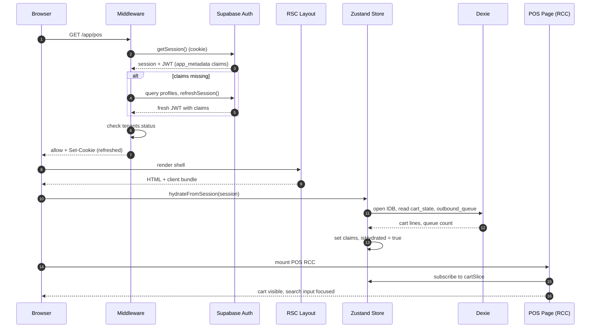
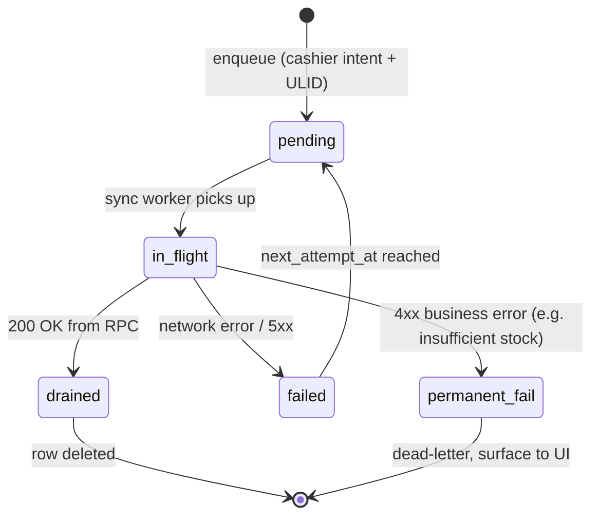
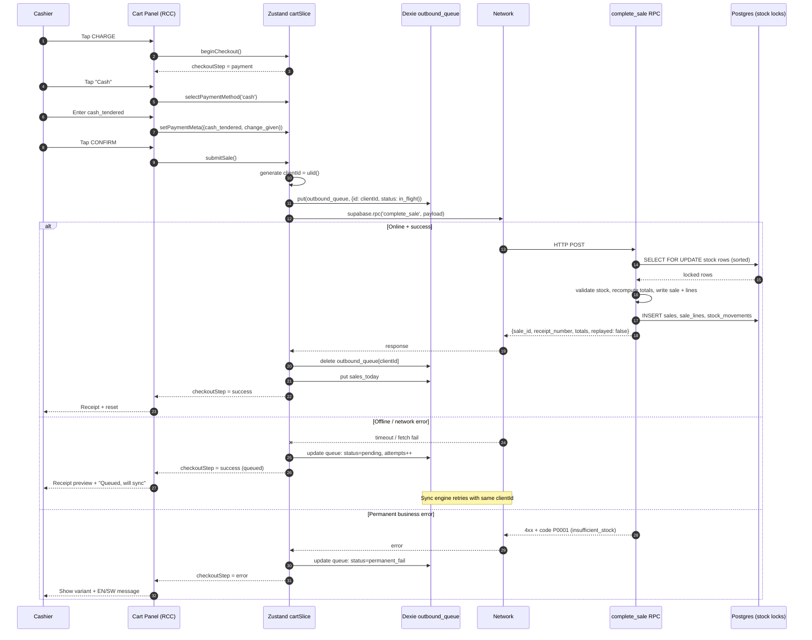
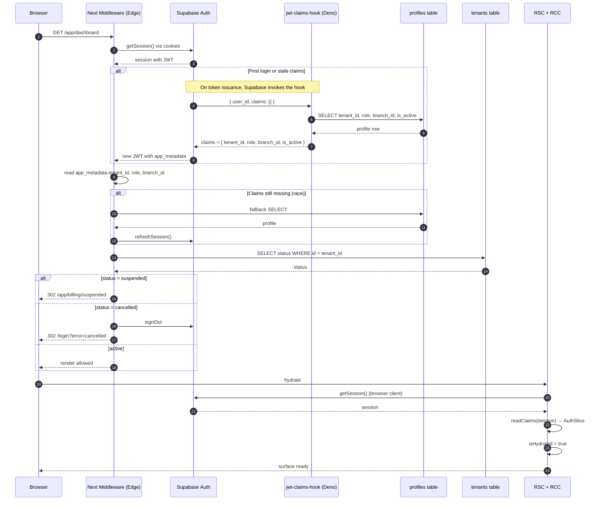

# NEXPOS Frontend Architecture & Execution Blueprint

> **Document Class:** Engineering Doctrine — RFC-grade
> **Authority:** Governing constitution for all frontend implementation work performed by Claude Code, Gemini CLI, Antigravity, and ChatGPT-assisted workflows.
> **Status:** Ratified. No clause in this document may be relaxed by a downstream agent without an explicit, written directive from the human architect that names the clause being suspended.
> **Stack of Record:** Next.js 14.2.3 (App Router) · React 18 · TypeScript 5 · Tailwind CSS · shadcn/ui · Supabase (Postgres + RLS + Edge) · Dexie 4 (IndexedDB) · Zustand 4 · TanStack Query 5
> **Target Market:** Tanzania, retail SMB. Currency TZS. VAT 18%. Volatile connectivity. Tablet-first cashier UX.

---

## Reader Warning

This document is **not** a UI specification. It is the runtime contract for a transactionally sensitive, offline-capable, multi-tenant, branch-scoped, RLS-enforced retail operating system. If a future implementer feels the urge to "simplify" something in here, they are almost certainly about to introduce a correctness failure that will manifest as duplicate sales, stock drift, tenant data bleed, or cashier-facing downtime during a queue.

Read everything once before touching code.

---

# Part Zero — Core Architectural Truths

These are the irreversible laws. Every decision elsewhere in this document is downstream of them. If a proposed change appears to violate one of these, the proposed change is wrong. There are no exceptions.

## Truth 1 — The Frontend Is Not Authoritative for Money

The browser is a presentation surface. It is allowed to estimate, preview, and display totals so the cashier and customer can confirm intent. It is **never** the source of truth for the ledger. Subtotals, VAT, discounts, totals, and stock deltas displayed in the UI are advisory until `complete_sale` returns success and emits its server-computed numbers.

A POS that trusts JavaScript with the books is a POS that has a tax fraud incident, a stock variance crisis, or a refund dispute it cannot defend. NEXPOS will have none of those because the architecture forbids them at the contract layer.

**Operational consequence:** Every receipt printed, every dashboard KPI, every audit line is sourced from the server response or from `sales` / `sale_lines` / `stock_movements`. Never from a Zustand cart, never from a TanStack Query cache that was not invalidated by the RPC response itself.

## Truth 2 — POS Is Not a Dashboard. POS Is a Real-Time Industrial Control System.

A dashboard tolerates a 600ms render. A POS does not. A cashier facing a queue of fifteen customers on a Friday evening cannot wait for React to settle. A dashboard tolerates an undefined value flashing for a frame. A POS does not — the cashier will tap the wrong button.

POS UI is engineered for **latency budgets**, not "good enough" UX. The budget is:

| Interaction | Hard Ceiling |
|---|---|
| Tap "Add to cart" → visible cart line | 80ms |
| Type SKU → search result paint | 120ms |
| Tap "Charge" → payment panel visible | 100ms |
| Tap "Confirm cash payment" → success state | 1500ms online · 250ms offline (queued) |
| Print/email receipt trigger | non-blocking — runs after success state |

If a feature cannot meet its budget, it does not ship to the POS surface. It ships to the back office.

## Truth 3 — Offline Is Not a Feature. Offline Is the Default Assumption.

Tanzanian retail connectivity is not "occasionally bad." It is "structurally unreliable" — fibre cuts, power rationing, ISP outages, congested 4G in market areas. The cashier cannot tell the customer "the internet is down." The cashier must complete the sale, take the cash, and let the system reconcile when reachable.

Therefore: **every checkout flow must succeed offline as a queued mutation, with an idempotent client-generated ULID, and reconcile deterministically when the connection returns.** Online is a fast path. Offline is the contract.

This is not a "PWA enhancement." This is the load-bearing wall.

## Truth 4 — Optimism Is a Vice in Checkout

Optimistic UI is a useful pattern for likes, comments, and toggles. It is **forbidden** for monetary state. The cart can optimistically reflect a quantity change. The checkout cannot optimistically show "Sale Complete." A sale is complete when `complete_sale` returns a `sale_id` and a `receipt_number` and either `replayed: false` (newly committed) or `replayed: true` (idempotent retry). Until then, the UI is in `submitting` state and the cashier sees a deterministic spinner with a non-cancellable barrier over the charge button.

The cost of premature optimism in retail: a cashier confirms a sale that the server later rejects for insufficient stock, the customer walks out with goods, the stock ledger never decrements, the next reorder triggers on phantom inventory. Every such drift is a real cash leak.

## Truth 5 — Tenant ID Is a Security Boundary, Not a Convenience Parameter

`tenant_id` exists in exactly **one** authoritative location: the JWT `app_metadata` injected by the `jwt-claims-hook` Edge Function. The frontend reads it for display and routing. The frontend **never** sends it in a query, mutation, RPC parameter, URL path, or request body. RLS uses `public.current_tenant()` which reads the JWT server-side.

Any code in the codebase that appends `.eq('tenant_id', X)` to a Supabase client query is a defect — not a style violation, a defect — because it signals the author misunderstood the trust model and may have written code elsewhere that bypasses it. Such code must be removed on sight.

## Truth 6 — Stock Mutations Travel One Road

Stock cannot be written directly. There is no client-facing INSERT or UPDATE policy on `stock_levels`. Every stock movement flows through exactly two RPCs:

- `public.complete_sale(p_input jsonb)` — sale, refund, return (via reason discriminator)
- `public.adjust_stock(...)` — manual correction, owner/manager only

Both require a **client-generated ULID** as the idempotency key. Both are server-locked via `SELECT … FOR UPDATE` with deterministic ordering by `variant_id` to prevent deadlocks. The frontend's job is to (a) generate the ULID at the moment of user intent, (b) persist it before the network call, (c) reuse it on every retry. Generating a new ULID per retry is the canonical way to cause a duplicate sale. Treat the ULID like a transaction nonce in a payment system, because that is what it is.

## Truth 7 — Concurrency and Idempotency Are the Real Complexity Centers

The visual design is not the hard part. The hard part is:

- Two cashiers on two tablets in the same branch tap "Charge" for the last unit of SKU-X within 80ms of each other.
- A cashier's tablet loses WiFi mid-`complete_sale`. The request hit the server. The response never arrived. The cashier retries.
- A cashier opens POS in two browser tabs by accident, makes a sale in tab A, switches to tab B which still shows old stock.
- A device sits offline for 6 hours, accumulates 18 sales in the local queue, regains connection during the evening peak, and floods the server while live cashiers are still transacting.

Each of these scenarios is solved by a specific architectural mechanism (server-side row locks, ULID idempotency, BroadcastChannel mesh, P0 priority queue with adaptive batching). Each mechanism is non-negotiable. None of them is decorative.

## Truth 8 — Realtime Subscriptions Are Expensive and Suspicious by Default

Supabase Realtime is a powerful tool that, when applied with naive enthusiasm, will turn 50 tables into 50 open WebSocket subscriptions, consume the browser's connection pool, fragment React state, and crash the tablet within 2 hours of a busy day. Realtime is **opt-in**, **scoped**, and **throttled**. The default for any new feature is "no subscription, refetch on focus." Subscriptions are added only after a written justification.

## Truth 9 — There Are Four State Realms. Each Has Sole Ownership of Its Data.

| Realm | Owns | Forbidden from owning |
|---|---|---|
| **Zustand** | Cart, auth claims, active branch, sync queue status, multi-tab leader, UI mode (e.g. cashier vs manager view) | Server data, transient UI state, form inputs |
| **TanStack Query** | All Supabase reads (product catalog, customer search, reports, sales history) | Cart, auth, sync queue, anything offline-mutable |
| **Dexie (IndexedDB)** | Cached catalog mirror, outbound mutation queue, cached customer list, last-known stock snapshot per branch | Auth tokens (use Supabase's storage), realtime ephemera |
| **React local state** | Form inputs, focused row, hover state, dropdown open/closed, input drafts | Cart, auth, anything that must survive remount |

Cross-realm leakage is a smell. If a piece of state is in two realms simultaneously, one of them is wrong.

## Truth 10 — Architectural Drift Is Caused by "Just This Once"

Every doctrine on earth is destroyed by exceptions. The way drift enters NEXPOS is:

- "Just this once, let me compute the total client-side, the server is slow today."
- "Just this once, let me pass `tenant_id` in the URL, RLS is fine."
- "Just this once, let me skip the ULID, it's a test."
- "Just this once, let me put the search filter in Zustand, it's easier."

Each "just this once" is a defect. The reviewer's job is to reject every one of them, every time, regardless of urgency. The cost of an exception is paid by every future engineer who must now reason about whether the rule applies in their case.

---

# Part One — Required Blueprint Sections (A–J)

---

## Section A · System Invariants

The invariants below are checked at code review, enforced by ESLint rules where automatable, and asserted at runtime where they cannot be statically verified. A pull request that violates any invariant does not merge.

### A.1 Financial Calculation Invariant

**Statement:** No value written into `sales.total`, `sales.subtotal`, `sales.vat_amount`, `sales.discount_amount`, or any `sale_lines.line_total` field originates from frontend JavaScript.

**Mechanism:**
- The frontend computes a *preview* of totals for display.
- The frontend sends `lines` with `variant_id`, `quantity`, `unit_price`, `line_discount` to `complete_sale`.
- The server recomputes everything, applies VAT 18%, applies order-level discount, locks stock, writes lines.
- The frontend renders the response.

**Lint rule:** No `supabase.from('sales').insert(...)` or `supabase.from('sale_lines').insert(...)` may exist in the codebase outside of the `complete_sale` server function. ESLint rule `no-restricted-syntax` enforces this at the import-call level.

**Runtime assertion:** The response handler compares `response.total` against the locally-previewed total. If divergence exceeds 0.5 TZS (effectively zero given TZS has no sub-units, this catches gross errors only), telemetry emits a `SALE_PREVIEW_DRIFT` event with both values. The drift does not block the sale — the server is right by definition — but it surfaces frontend bugs to the operations team.

### A.2 Tenant Boundary Invariant

**Statement:** The frontend never knows its own `tenant_id` for the purpose of constructing a query. It knows it only for display.

**Read source of truth:**

```typescript
// lib/auth/claims.ts
export interface JwtClaims {
  tenant_id: string;      // ULID
  role: 'owner' | 'manager' | 'cashier' | 'viewer';
  branch_id: string | null;
  is_active: boolean;
}

export function readClaims(session: Session): JwtClaims | null {
  const meta = session.user.app_metadata;
  if (!meta?.tenant_id) return null;
  return {
    tenant_id: meta.tenant_id,
    role: meta.role,
    branch_id: meta.branch_id ?? null,
    is_active: meta.is_active ?? false,
  };
}
```

`readClaims` returns claims for **display, routing, and UI gating only**. The `tenant_id` field is never appended to any Supabase query argument.

**Forbidden patterns:**

```typescript
// ❌ NEVER
supabase.from('products').select('*').eq('tenant_id', claims.tenant_id);

// ❌ NEVER
fetch(`/api/products?tenant=${claims.tenant_id}`);

// ❌ NEVER
supabase.rpc('complete_sale', { tenant_id: claims.tenant_id, ... });
```

**Correct pattern:**

```typescript
// ✅ RLS handles tenant scoping automatically
supabase.from('products').select('*');

// ✅ tenant_id is derived server-side from current_tenant()
supabase.rpc('complete_sale', { p_input: { branch_id, lines, ... } });
```

**Lint rule:** ESLint rule `nexpos/no-tenant-in-query` flags any `.eq('tenant_id'`, any URL or RPC parameter named `tenant_id`, and any RPC argument key matching `tenant_id`.

### A.3 Stock Mutation Invariant

**Statement:** `stock_levels` is read-only to the frontend client. Period.

**Allowed mutations to stock:**
- `complete_sale` RPC → server decrements on sale, increments on refund
- `adjust_stock` RPC → server applies signed delta for manual corrections (owner/manager only)

**Forbidden:**
- Any `supabase.from('stock_levels').update(...)` or `.insert(...)` or `.upsert(...)`
- Any `supabase.from('stock_movements').insert(...)` — movements are written by the RPCs

**Lint rule:** `nexpos/no-direct-stock-mutation` blocks all direct stock table writes.

### A.4 Idempotency Invariant

**Statement:** Every state-changing RPC requires a client-generated ULID. The ULID is generated at the moment of *intent* (cashier taps "Confirm"), persisted to Dexie *before* the network call, and reused for every retry.

**ULID generation:**

```typescript
// lib/idempotency/ulid.ts
import { ulid } from 'ulidx';

export function newSaleClientId(): string {
  return ulid(); // 26 chars, lexicographically sortable, monotonic within ms
}
```

**Persist-before-call pattern:**

```typescript
// lib/pos/checkout.ts
export async function submitSale(cart: CartState, branchId: string): Promise<SaleResult> {
  const clientId = newSaleClientId();
  const payload: CompleteSaleInput = { client_id: clientId, branch_id: branchId, ...cart.toPayload() };

  // CRITICAL: persist intent BEFORE network call
  await db.outbound_queue.put({
    id: clientId,
    kind: 'complete_sale',
    payload,
    status: 'pending',
    attempts: 0,
    created_at: Date.now(),
  });

  try {
    const { data, error } = await supabase.rpc('complete_sale', { p_input: payload });
    if (error) throw error;
    await db.outbound_queue.delete(clientId); // success → drain
    return data;
  } catch (e) {
    // queue stays. Sync engine will retry with same clientId.
    throw e;
  }
}
```

**Server contract:** `complete_sale` accepts the same `client_id` repeatedly and returns the original result with `replayed: true` on the second and subsequent calls. The frontend treats `replayed: true` identically to `replayed: false` — the sale is committed either way.

### A.5 Calculation Drift Detection (Telemetry Invariant)

Each successful sale logs an anonymized telemetry event:

```typescript
interface SaleTelemetry {
  client_id: string;
  preview_subtotal: number;
  preview_vat: number;
  preview_total: number;
  server_subtotal: number;
  server_vat: number;
  server_total: number;
  drift_total: number;       // server_total - preview_total
  network_class: 'online' | 'offline-queued' | 'replayed';
  duration_ms: number;
}
```

Non-zero `drift_total` is a defect signal. Drift > 100 TZS triggers an alert.

---

## Section B · Frontend Operating & Runtime Model

This section is the runtime contract: which rendering boundary owns what, where data crosses the wire, and how routing, middleware, and caching interact.

### B.1 Server Components vs. Client Components

Next.js App Router gives us two render contexts. Misallocation causes either hydration breaks or unnecessary server load.

| Surface | Boundary | Justification |
|---|---|---|
| `/app/(workspace)/dashboard` (KPIs, charts) | **RSC** with streaming Suspense | Server-fetch is cheaper than ship-then-fetch. KPIs are not user-interactive. |
| `/app/(workspace)/products` list | **RSC** with paginated server fetch | Long list, no user mutation per row. |
| `/app/(workspace)/products/[id]/edit` form | **RCC** | Form state, optimistic field updates. |
| `/app/(workspace)/pos` (the entire POS surface) | **RCC** | Heavy interactivity, offline write path, Zustand subscription. Server-rendering POS is anti-pattern. |
| `/app/(workspace)/sales/[id]` receipt view | **RSC** | Static post-commit data; no editing. |
| `/app/(workspace)/reports/*` | **RSC** with server-side data prep | Heavy data transformation, no interactivity beyond filter inputs. |
| Layouts (sidebar, top nav) | **RSC shell** wrapping **RCC** for interactive nav | Shell is static per route; nav state is local. |
| Middleware | Edge runtime | Session refresh, tenant status check, redirect. |

**Hard rule:** No `'use client'` directive on a utility module. `'use client'` is an RSC boundary marker — placing it on a non-component file (a sync engine, a Dexie wrapper, a crypto helper) causes the webpack module ID mismatch documented in the May 2026 audit. If a file has no JSX export and no React hook export, it does not get `'use client'`. Ever.

**Module classification table:**

| File pattern | `'use client'` rule |
|---|---|
| `app/**/*.tsx` (page/layout files) | RSC unless interactive; declare with directive only if needed |
| `components/**/*.tsx` | `'use client'` only if the component uses hooks or browser APIs |
| `lib/**/*.ts` (no .tsx) | **Never** add `'use client'`. These are isomorphic utilities or server-only. |
| `hooks/**/*.ts` | `'use client'` required (hooks are client-only by definition) |
| `lib/supabase/server.ts` | No directive. Server-only via `cookies()` from `next/headers`. |
| `lib/supabase/client.ts` | `'use client'` required. |

### B.2 Middleware Architecture

The middleware is the gatekeeper. It runs on every request to `/app/*` and is responsible for session refresh, claim hydration, tenant status enforcement, and role-based default routing.

**File:** `middleware.ts` (project root)

```typescript
import { createServerClient } from '@supabase/ssr';
import { NextResponse, type NextRequest } from 'next/server';

const PROTECTED = /^\/app\//;
const PUBLIC_ALLOW = ['/login', '/forgot-password', '/auth/callback'];

export async function middleware(req: NextRequest) {
  const res = NextResponse.next();
  const supabase = createServerClient(/* env, cookies adapter using req/res */);

  // 1. Refresh session (sets cookies on res)
  const { data: { session } } = await supabase.auth.getSession();

  const pathname = req.nextUrl.pathname;
  const isProtected = PROTECTED.test(pathname);
  const isPublic = PUBLIC_ALLOW.some(p => pathname.startsWith(p));

  // 2. Public routes pass
  if (!isProtected) return res;
  if (isPublic) return res;

  // 3. No session → /login
  if (!session) {
    return NextResponse.redirect(new URL('/login', req.url));
  }

  // 4. Read claims from JWT app_metadata
  const meta = session.user.app_metadata;
  let tenantId = meta?.tenant_id as string | undefined;
  let role = meta?.role as string | undefined;
  let branchId = meta?.branch_id as string | null | undefined;

  // 5. Claims missing → JWT hook has not populated yet (first login race).
  //    Fall back to profiles lookup. Do not assume — fetch.
  if (!tenantId || !role) {
    const { data: profile } = await supabase
      .from('profiles')
      .select('tenant_id, role, branch_id, is_active')
      .eq('id', session.user.id)
      .single();
    if (!profile || !profile.is_active) {
      await supabase.auth.signOut();
      return NextResponse.redirect(new URL('/login?error=inactive', req.url));
    }
    tenantId = profile.tenant_id;
    role = profile.role;
    branchId = profile.branch_id;
    // Force token refresh so next request has claims
    await supabase.auth.refreshSession();
  }

  // 6. Check tenant status
  const { data: tenant } = await supabase
    .from('tenants')
    .select('status')
    .eq('id', tenantId)
    .single();

  if (!tenant) {
    return NextResponse.redirect(new URL('/login?error=no_tenant', req.url));
  }

  if (tenant.status === 'suspended') {
    if (!pathname.startsWith('/app/billing/suspended')) {
      return NextResponse.redirect(new URL('/app/billing/suspended', req.url));
    }
    return res;
  }

  if (tenant.status === 'cancelled') {
    await supabase.auth.signOut();
    return NextResponse.redirect(new URL('/login?error=cancelled', req.url));
  }

  // 7. Root /app → role-based default
  if (pathname === '/app' || pathname === '/app/') {
    const target = role === 'cashier' ? '/app/pos' : '/app/dashboard';
    return NextResponse.redirect(new URL(target, req.url));
  }

  // 8. Branch-scoped role attempting cross-branch access
  if (role === 'cashier' && !branchId) {
    // Cashier without a branch is a config error
    await supabase.auth.signOut();
    return NextResponse.redirect(new URL('/login?error=no_branch', req.url));
  }

  return res;
}

export const config = {
  matcher: ['/((?!_next/static|_next/image|favicon.ico|.*\\.(?:png|jpg|jpeg|gif|webp|svg|ico)$).*)'],
};
```

**Why the middleware does a profile fallback:** The JWT claims hook fires on token issuance. There is a small window during the first login (and after a profile update) where the session exists but the JWT has not yet re-issued with the new claims. Middleware bridges this with a direct profile read. Without this fallback, the user lands on a half-broken app for one navigation cycle.

### B.3 Offline Data Boundary

Not every surface is offline-capable. Declaring everything offline is naive — it bloats Dexie, complicates conflict resolution, and gives a false sense of resilience.

| Surface | Offline Status | Justification |
|---|---|---|
| POS cart + checkout (cash, mpesa-with-reference, card-via-terminal-reference) | **REQUIRED OFFLINE** | Cashier cannot stop on connectivity loss |
| Product catalog read | **CACHED, READ-ONLY** | Last sync mirrored to Dexie |
| Stock read for variant lookup | **CACHED WITH STALENESS BANNER** | Show local count, mark "as of HH:MM" |
| Customer search & create | **REQUIRED OFFLINE** | New customer common at checkout |
| Sales history (today) | **CACHED, READ-ONLY** | Last sync mirrored to Dexie |
| Sales history (>1 day) | **ONLINE ONLY** | Heavy data, not worth Dexie cost |
| Dashboard KPIs | **ONLINE ONLY** | Show "Last updated HH:MM" + "Offline — reconnect to refresh" |
| Reports & analytics | **ONLINE ONLY** | |
| Settings, user management | **ONLINE ONLY** | |
| Billing | **ONLINE ONLY** | Stripe + tenant status |
| Stock adjustment (`adjust_stock`) | **ONLINE ONLY** | Owner/manager action, not throughput-critical |
| Refunds & voids | **ONLINE ONLY** initially. Queueable in Phase 7. | Complex reconciliation; defer until base flow is stable. |

### B.4 Caching & Invalidation Doctrine

Three caches exist: Next.js fetch cache (server), TanStack Query cache (client), Dexie (durable client). They have different invalidation rules.

**Next.js fetch cache:**
- `revalidate: 60` for tenant-scoped product lists rendered in RSC.
- `revalidate: 0` (no-store) for any page rendering current stock.
- `revalidate: 3600` for `tenants.status` checks in middleware (stale-while-revalidate acceptable for suspension state — the database is the final authority and RLS will still block).

**TanStack Query:**
- `staleTime: 30_000` for product catalog and customer search.
- `staleTime: 0` for stock reads — always considered stale.
- `gcTime: 5 * 60 * 1000` (5 min) garbage collection for everything.
- `refetchOnWindowFocus: true` for stock and sales data.
- `refetchOnReconnect: true` globally — when the connection returns, refetch everything.

**Dexie:**
- Catalog mirror refreshes on app boot and on demand from "Refresh catalog" admin button.
- Outbound queue never expires until successfully drained.
- Cached stock snapshot is treated as advisory after 30 minutes — UI shows "stock data is stale" banner.

**Tenant change invalidation:** When the JWT refreshes with a new `tenant_id` (only possible if the user re-authenticates as a different account), the entire QueryClient is reset and Dexie's catalog tables are dropped. This is a hard boundary; tenant data must never leak across login sessions.

```typescript
// hooks/use-auth-sync.ts (excerpt)
useEffect(() => {
  const prevTenant = lastTenantRef.current;
  if (prevTenant && prevTenant !== claims.tenant_id) {
    queryClient.clear();
    db.tables.forEach(t => { if (t.name.startsWith('local_')) t.clear(); });
  }
  lastTenantRef.current = claims.tenant_id;
}, [claims.tenant_id]);
```

---

## Section C · State Architecture & Hydration

### C.1 State Realm Ownership Matrix

| Data | Realm | Persistence | Reset on logout |
|---|---|---|---|
| JWT claims (tenant_id, role, branch_id) | Zustand `authSlice` | Memory (rehydrated from Supabase session) | Yes |
| Current branch (for owners who can switch) | Zustand `authSlice.activeBranchId` | Persisted to localStorage | Yes |
| Active cart | Zustand `cartSlice` | Persisted to Dexie `cart_state` (single row) | Yes |
| Sync queue status (count, last error, leader status) | Zustand `syncSlice` | Memory | N/A |
| Multi-tab leader election state | Zustand `meshSlice` | Memory | N/A |
| Product catalog (search results, by-category lists) | TanStack Query | Memory + Dexie mirror via custom persister for offline | Yes |
| Customer search | TanStack Query | Memory + Dexie mirror | Yes |
| Sales history | TanStack Query | Memory + Dexie mirror (today only) | Yes |
| Dashboard KPIs | TanStack Query | Memory | Yes |
| Outbound mutation queue | Dexie `outbound_queue` table | Durable IndexedDB | **NO** — flush only after successful sync |
| Cached catalog | Dexie `local_products`, `local_variants` | Durable | Yes (on tenant switch) |
| Cached stock | Dexie `local_stock_levels` | Durable | Yes (on tenant switch) |
| Search input value (product, customer) | React `useState` | Component lifetime | N/A |
| Modal open state, dropdown state | React `useState` | Component lifetime | N/A |
| Active table row, hover, focus | React `useState` | Component lifetime | N/A |

### C.2 Zustand Slice Definitions

NEXPOS uses a single Zustand store composed of slices. The store is created once and exposed via a typed hook.

```typescript
// lib/state/types.ts
import { type StateCreator } from 'zustand';
import { type CartLine, type PaymentMethod } from '@/lib/types';

export interface AuthSlice {
  // ── State
  isAuthenticated: boolean;
  isHydrated: boolean;             // true once claims + session loaded
  userId: string | null;
  tenantId: string | null;
  role: 'owner' | 'manager' | 'cashier' | 'viewer' | null;
  branchId: string | null;          // assigned branch (cashier) or null
  activeBranchId: string | null;    // currently selected branch (owner/manager can switch)
  isActive: boolean;
  // ── Actions
  hydrateFromSession: (session: import('@supabase/supabase-js').Session | null) => Promise<void>;
  setActiveBranch: (branchId: string) => void;
  signOut: () => Promise<void>;
}

export interface CartSlice {
  // ── State
  lines: CartLine[];
  orderDiscount: number;            // TZS, integer
  customerId: string | null;
  checkoutStep: 'cart' | 'payment' | 'tendered' | 'success' | 'error';
  paymentMethod: PaymentMethod | null;
  paymentMeta: Record<string, unknown>;
  pendingClientId: string | null;   // ULID, set on Confirm tap
  errorMessage: string | null;
  errorMessageSw: string | null;
  lastReceiptNumber: string | null;
  lastSaleId: string | null;
  // ── Actions
  addVariant: (variant: { id: string; sku: string; sell_price: number; name: string }) => void;
  setLineQty: (variantId: string, quantity: number) => void;
  setLineDiscount: (variantId: string, discount: number) => void;
  removeLine: (variantId: string) => void;
  setOrderDiscount: (discount: number) => void;
  setCustomer: (customerId: string | null) => void;
  beginCheckout: () => void;
  selectPaymentMethod: (m: PaymentMethod) => void;
  setPaymentMeta: (meta: Record<string, unknown>) => void;
  submitSale: () => Promise<void>;
  acknowledgeSuccess: () => void;
  retryAfterError: () => void;
  abandonCart: () => void;          // cashier "Cancel" — guarded with confirm
  // ── Derived (selectors live in /lib/state/selectors.ts)
}

export interface SyncSlice {
  pendingCount: number;
  lastSyncAt: number | null;
  lastError: string | null;
  isOnline: boolean;
  isLeader: boolean;                // BroadcastChannel mesh leader
  peerCount: number;
  // Actions
  recomputeFromQueue: () => Promise<void>;
  setOnline: (online: boolean) => void;
  setLeader: (isLeader: boolean) => void;
}

export interface UISlice {
  // Only persistent UI mode goes here.
  // Transient state (dropdown open, hover) stays in component state.
  sidebarCollapsed: boolean;
  density: 'comfortable' | 'compact';
  language: 'en' | 'sw';
  toggleSidebar: () => void;
  setDensity: (d: 'comfortable' | 'compact') => void;
  setLanguage: (l: 'en' | 'sw') => void;
}

export type AppState = AuthSlice & CartSlice & SyncSlice & UISlice;
```

```typescript
// lib/state/store.ts
'use client';
import { create } from 'zustand';
import { persist, createJSONStorage } from 'zustand/middleware';
import { createAuthSlice } from './slices/auth';
import { createCartSlice } from './slices/cart';
import { createSyncSlice } from './slices/sync';
import { createUiSlice } from './slices/ui';
import type { AppState } from './types';

export const useAppStore = create<AppState>()(
  persist(
    (...a) => ({
      ...createAuthSlice(...a),
      ...createCartSlice(...a),
      ...createSyncSlice(...a),
      ...createUiSlice(...a),
    }),
    {
      name: 'nexpos-ui',
      storage: createJSONStorage(() => localStorage),
      // Only persist UI prefs and active branch. NOT cart (cart lives in Dexie).
      // NOT auth (auth comes from Supabase session).
      partialize: (state) => ({
        sidebarCollapsed: state.sidebarCollapsed,
        density: state.density,
        language: state.language,
        activeBranchId: state.activeBranchId,
      }),
    },
  ),
);

// Typed selector hooks
export const useAuth = () => useAppStore((s) => ({
  isAuthenticated: s.isAuthenticated,
  role: s.role,
  branchId: s.branchId,
  activeBranchId: s.activeBranchId,
  tenantId: s.tenantId,
}));

export const useCart = () => useAppStore((s) => s); // full slice; consumers use selectors
```

**Why cart is in Zustand but persisted to Dexie, not localStorage:**
- localStorage is synchronous, serialized JSON, 5MB cap — fragile for cart history during a long shift.
- Dexie writes are async but transactional and survive crashes.
- The Zustand cart is rehydrated from Dexie on app boot via `hydrateFromSession`.

### C.3 TanStack Query Responsibilities

TanStack owns **everything read from Supabase**. It does **nothing** with cart, auth, or queue state.

```typescript
// lib/queries/products.ts
import { useQuery } from '@tanstack/react-query';
import { supabase } from '@/lib/supabase/client';

export function useProductSearch(query: string, branchId: string | null) {
  return useQuery({
    queryKey: ['products', 'search', branchId, query],
    queryFn: async () => {
      if (!query) return [];
      const { data, error } = await supabase
        .from('product_variants')
        .select('id, sku, size, color, sell_price, family:family_id(name, brand)')
        .or(`sku.ilike.%${query}%,family.name.ilike.%${query}%`)
        .eq('is_active', true)
        .limit(50);
      if (error) throw error;
      return data;
    },
    enabled: query.length >= 2,
    staleTime: 30_000,
  });
}
```

**Mutation pattern: never used for cart-bound sales.** Mutations exist for admin/management actions (creating a product, adjusting stock, updating a customer). Sale submission does **not** go through `useMutation` — it goes through the explicit cart action, which manages its own optimistic-locking lifecycle via the outbound queue.

### C.4 Auth Hydration Lifecycle

The exact sequence from app boot to "POS is ready to accept input":



**Hydration contract:**

1. Middleware guarantees a session exists or redirects.
2. RSC shell renders with no user-specific data — purely structural.
3. The first client component to mount inside `/app/*` calls `hydrateFromSession`.
4. `hydrateFromSession`:
   - Reads `app_metadata` claims (already validated by middleware).
   - Opens Dexie connection.
   - Restores cart from `cart_state` row.
   - Computes pending queue count.
   - Sets `isHydrated = true`.
5. POS UI is gated on `isHydrated`. Before hydration, a deterministic skeleton (no spinner — skeleton, with correct geometry) renders to prevent layout shift.

```typescript
// components/auth/auth-gate.tsx
'use client';
import { useEffect } from 'react';
import { createBrowserClient } from '@/lib/supabase/client';
import { useAppStore } from '@/lib/state/store';
import { POSSkeleton } from '@/components/pos/skeleton';

export function AuthGate({ children }: { children: React.ReactNode }) {
  const isHydrated = useAppStore((s) => s.isHydrated);
  const hydrate = useAppStore((s) => s.hydrateFromSession);

  useEffect(() => {
    const supabase = createBrowserClient();
    supabase.auth.getSession().then(({ data }) => hydrate(data.session));
    const { data: sub } = supabase.auth.onAuthStateChange((_event, session) => hydrate(session));
    return () => sub.subscription.unsubscribe();
  }, [hydrate]);

  if (!isHydrated) return <POSSkeleton />;
  return <>{children}</>;
}
```

**Why a skeleton, not a spinner:** A spinner is a vague "something is happening." A skeleton with correct geometry tells the cashier "your familiar interface is loading in place" and prevents the perceived latency of layout shift. The cashier's hand is already moving toward the search input before the input is fully interactive — geometry-correct skeletons let muscle memory work.


---

## Section D · Data Layer & Offline Synchronization Engine

The offline subsystem is the most consequential — and most fragile — part of the frontend. It is engineered as a closed system with strict ownership boundaries.

### D.1 Dexie Schema

```typescript
// lib/db/schema.ts
import Dexie, { type Table } from 'dexie';

export interface LocalProductFamily {
  id: string;             // ULID
  name: string;
  brand: string | null;
  category_id: string | null;
  updated_at: number;     // ms epoch
}

export interface LocalVariant {
  id: string;             // ULID
  family_id: string;
  sku: string;
  size: string | null;
  color: string | null;
  cost_price: number;     // for margin display, owner/manager only
  sell_price: number;
  is_active: boolean;
  updated_at: number;
}

export interface LocalCustomer {
  id: string;             // ULID
  full_name: string;
  phone: string | null;
  updated_at: number;
  pending_sync?: 'create' | null; // customers created offline
  client_id?: string;     // ULID if created offline
}

export interface LocalStockSnapshot {
  branch_id: string;
  variant_id: string;
  on_hand: number;        // last known server value
  reorder_point: number;
  snapshot_at: number;
  // Note: NOT the source of truth. Local cart deductions are tracked separately.
}

export interface CartStateRow {
  id: 'singleton';        // one row only
  lines: Array<{ variant_id: string; quantity: number; unit_price: number; line_discount: number }>;
  order_discount: number;
  customer_id: string | null;
  updated_at: number;
}

export interface OutboundQueueItem {
  id: string;             // client_id ULID — primary key
  kind: 'complete_sale' | 'adjust_stock' | 'create_customer';
  payload: Record<string, unknown>;
  status: 'pending' | 'in_flight' | 'failed' | 'permanent_fail';
  attempts: number;
  last_error: string | null;
  next_attempt_at: number;  // ms epoch
  priority: 0 | 1 | 2 | 3;  // P0 = sale, P1 = stock, P2 = customer, P3 = telemetry
  created_at: number;
}

export interface SaleCachedRow {
  id: string;
  receipt_number: string;
  total: number;
  completed_at: number;
  payment_method: string;
}

export class NexposDB extends Dexie {
  local_families!: Table<LocalProductFamily, string>;
  local_variants!: Table<LocalVariant, string>;
  local_customers!: Table<LocalCustomer, string>;
  local_stock!: Table<LocalStockSnapshot, [string, string]>;  // composite [branch_id, variant_id]
  cart_state!: Table<CartStateRow, string>;
  outbound_queue!: Table<OutboundQueueItem, string>;
  sales_today!: Table<SaleCachedRow, string>;

  constructor() {
    super('nexpos');
    this.version(1).stores({
      local_families: 'id, name, updated_at',
      local_variants: 'id, family_id, sku, [family_id+is_active], updated_at',
      local_customers: 'id, phone, full_name, pending_sync, updated_at',
      local_stock: '[branch_id+variant_id], variant_id, branch_id',
      cart_state: 'id',
      outbound_queue: 'id, status, [status+next_attempt_at], priority, kind, created_at',
      sales_today: 'id, completed_at, receipt_number',
    });
  }
}

// Lazy singleton — never instantiated at import time (SSR-safe)
let _db: NexposDB | null = null;
export function getDb(): NexposDB {
  if (typeof window === 'undefined') {
    throw new Error('Dexie accessed in non-browser context');
  }
  if (!_db) _db = new NexposDB();
  return _db;
}
```

**Schema discipline:**
- Composite primary key on `local_stock` mirrors the server `stock_levels` PK exactly.
- Index `[status+next_attempt_at]` on `outbound_queue` is the hot read path for the sync worker.
- `cart_state` is a single-row table. Singleton pattern keeps schema simple; there is exactly one active cart per device.

### D.2 Outbound Queue Lifecycle



**Backoff schedule (exponential with jitter):**

| Attempt | Base delay | Jitter window |
|---|---|---|
| 1 | 1s | ±200ms |
| 2 | 3s | ±500ms |
| 3 | 10s | ±2s |
| 4 | 30s | ±5s |
| 5 | 90s | ±15s |
| 6+ | 300s | ±60s |

After 10 failed attempts on a `complete_sale`, the item moves to `permanent_fail` and surfaces a red banner: "Sale {receipt_preview} failed to sync. Tap to review." The cashier sees the original payload and can manually replay or void.

**Critical:** `permanent_fail` for a `complete_sale` means the sale **may or may not** have hit the server. The cashier flow must verify before voiding. A "Verify" action sends a `verify_sale` RPC (separate from `complete_sale`) that looks up by `client_id` and returns whether the sale exists. This avoids double-charging customers when the failure was a response timeout, not a server rejection.

### D.3 The Sync Engine

Single module, owns the queue drain logic. Runs in the leader tab only (see D.4 Mesh).

```typescript
// lib/sync/engine.ts
// NO 'use client' — this is a utility module loaded by client components.
// Placing 'use client' here causes the webpack ID mismatch documented in
// the May 2026 audit.

import { getDb } from '@/lib/db/schema';
import { supabase } from '@/lib/supabase/client';
import type { OutboundQueueItem } from '@/lib/db/schema';

const RPC_HANDLERS: Record<OutboundQueueItem['kind'], (payload: any) => Promise<unknown>> = {
  complete_sale: async (p) => {
    const { data, error } = await supabase.rpc('complete_sale', { p_input: p });
    if (error) throw error;
    return data;
  },
  adjust_stock: async (p) => {
    const { data, error } = await supabase.rpc('adjust_stock', p);
    if (error) throw error;
    return data;
  },
  create_customer: async (p) => {
    const { data, error } = await supabase.from('customers').insert(p).select().single();
    if (error) throw error;
    return data;
  },
};

const BACKOFF_MS = [1000, 3000, 10_000, 30_000, 90_000, 300_000];

function backoffFor(attempts: number): number {
  const base = BACKOFF_MS[Math.min(attempts, BACKOFF_MS.length - 1)];
  const jitter = base * 0.2 * (Math.random() * 2 - 1);
  return base + jitter;
}

let running = false;
let timer: ReturnType<typeof setTimeout> | null = null;

export function startSyncEngine() {
  if (running) return;
  running = true;
  tick();
}

export function stopSyncEngine() {
  running = false;
  if (timer) clearTimeout(timer);
}

async function tick() {
  if (!running) return;
  const db = getDb();
  const now = Date.now();

  // Pull eligible items, P0 first, oldest first.
  const due = await db.outbound_queue
    .where('[status+next_attempt_at]')
    .between(['pending', 0], ['pending', now])
    .toArray();
  due.sort((a, b) => a.priority - b.priority || a.created_at - b.created_at);

  for (const item of due) {
    if (!running) break;
    await db.outbound_queue.update(item.id, { status: 'in_flight' });
    try {
      const result = await RPC_HANDLERS[item.kind](item.payload);
      await onSuccess(item, result);
    } catch (e) {
      await onFailure(item, e);
    }
  }

  timer = setTimeout(tick, due.length > 0 ? 200 : 2000);
}

async function onSuccess(item: OutboundQueueItem, result: unknown) {
  const db = getDb();
  // Item-specific post-processing
  if (item.kind === 'complete_sale') {
    // Cache the result for receipts/history
    const r = result as { sale_id: string; receipt_number: string; total: number; completed_at: string };
    await db.sales_today.put({
      id: r.sale_id,
      receipt_number: r.receipt_number,
      total: r.total,
      completed_at: new Date(r.completed_at).getTime(),
      payment_method: (item.payload as any).payment_method,
    });
  }
  await db.outbound_queue.delete(item.id);
  // Notify peers
  postMeshMessage({ type: 'queue_drained', client_id: item.id });
}

async function onFailure(item: OutboundQueueItem, error: unknown) {
  const db = getDb();
  const isBusinessError = isPermanent(error);
  const attempts = item.attempts + 1;
  if (isBusinessError || attempts >= 10) {
    await db.outbound_queue.update(item.id, {
      status: 'permanent_fail',
      attempts,
      last_error: serializeError(error),
    });
    postMeshMessage({ type: 'queue_permanent_fail', client_id: item.id });
  } else {
    await db.outbound_queue.update(item.id, {
      status: 'pending',
      attempts,
      next_attempt_at: Date.now() + backoffFor(attempts),
      last_error: serializeError(error),
    });
  }
}

function isPermanent(e: unknown): boolean {
  // 4xx business errors are permanent. Stock insufficiency, validation,
  // role denial — none of these will succeed on retry.
  // Network errors and 5xx are transient.
  const code = (e as any)?.code;
  return typeof code === 'string' && (code.startsWith('P0') || code === '23514' || code === '42501');
}

function serializeError(e: unknown): string {
  try { return JSON.stringify(e, Object.getOwnPropertyNames(e as object)).slice(0, 1000); }
  catch { return String(e); }
}

// Mesh notification helper (defined in mesh module)
function postMeshMessage(msg: unknown) {
  if (typeof window === 'undefined') return;
  try { window.dispatchEvent(new CustomEvent('nexpos:mesh-out', { detail: msg })); } catch {}
}
```

### D.4 BroadcastChannel Mesh

Multiple tabs/windows of the same browser may be open on the cashier's device. Without coordination, two tabs both try to drain the queue, both subscribe to Realtime, both write to Dexie. This produces duplicate work and race conditions.

The mesh elects a single **leader tab** that owns the sync engine. Followers receive state via BroadcastChannel and render read-only.

```typescript
// lib/sync/mesh.ts
// NO 'use client' — utility module.

import { startSyncEngine, stopSyncEngine } from './engine';

const CHANNEL = 'nexpos-mesh-v1';
const HEARTBEAT_MS = 1000;
const LEADER_TIMEOUT_MS = 3000;

interface MeshState {
  selfId: string;
  isLeader: boolean;
  leaderId: string | null;
  lastLeaderSeen: number;
  peers: Set<string>;
}

let state: MeshState | null = null;
let channel: BroadcastChannel | null = null;
let heartbeatTimer: ReturnType<typeof setInterval> | null = null;
let electionTimer: ReturnType<typeof setTimeout> | null = null;

export function initMesh(): MeshState {
  if (typeof window === 'undefined') {
    throw new Error('Mesh requires browser');
  }
  if (state) return state;

  state = {
    selfId: crypto.randomUUID(),
    isLeader: false,
    leaderId: null,
    lastLeaderSeen: 0,
    peers: new Set(),
  };

  channel = new BroadcastChannel(CHANNEL);
  channel.onmessage = onMessage;

  // Announce self
  send({ type: 'hello', from: state.selfId });

  // Start election timer
  scheduleElection();

  // Heartbeat
  heartbeatTimer = setInterval(() => {
    if (!state) return;
    if (state.isLeader) {
      send({ type: 'leader_heartbeat', from: state.selfId, at: Date.now() });
    } else {
      send({ type: 'follower_ping', from: state.selfId });
    }
    // Garbage collect stale peers
    // (simplified — full version tracks last-seen per peer)
    if (state.leaderId && Date.now() - state.lastLeaderSeen > LEADER_TIMEOUT_MS) {
      becomeFollower(null);
      scheduleElection();
    }
  }, HEARTBEAT_MS);

  return state;
}

function onMessage(ev: MessageEvent) {
  if (!state) return;
  const msg = ev.data;
  switch (msg.type) {
    case 'hello':
      state.peers.add(msg.from);
      if (state.isLeader) send({ type: 'leader_heartbeat', from: state.selfId, at: Date.now() });
      break;
    case 'leader_heartbeat':
      state.leaderId = msg.from;
      state.lastLeaderSeen = msg.at;
      if (state.isLeader && msg.from !== state.selfId) {
        // Split-brain. Tie-break by ID (lower wins).
        if (msg.from < state.selfId) becomeFollower(msg.from);
      }
      break;
    case 'leader_claim':
      // Election in progress; another tab claims leadership
      if (msg.from < state.selfId) {
        becomeFollower(msg.from);
      }
      // else: ignore, our claim will win
      break;
    case 'follower_ping':
      state.peers.add(msg.from);
      break;
    case 'sync_event':
      // Leader broadcasts queue events to followers for UI updates
      window.dispatchEvent(new CustomEvent('nexpos:sync-event', { detail: msg.payload }));
      break;
    case 'cart_update':
      window.dispatchEvent(new CustomEvent('nexpos:cart-mirror', { detail: msg.payload }));
      break;
  }
}

function scheduleElection() {
  if (electionTimer) clearTimeout(electionTimer);
  electionTimer = setTimeout(() => {
    if (!state) return;
    if (state.leaderId) return; // someone already won
    becomeLeader();
  }, 500 + Math.random() * 500);
}

function becomeLeader() {
  if (!state) return;
  state.isLeader = true;
  state.leaderId = state.selfId;
  state.lastLeaderSeen = Date.now();
  send({ type: 'leader_claim', from: state.selfId });
  send({ type: 'leader_heartbeat', from: state.selfId, at: Date.now() });
  startSyncEngine();
  window.dispatchEvent(new CustomEvent('nexpos:leader-changed', { detail: { isLeader: true } }));
}

function becomeFollower(leaderId: string | null) {
  if (!state) return;
  state.isLeader = false;
  state.leaderId = leaderId;
  stopSyncEngine();
  window.dispatchEvent(new CustomEvent('nexpos:leader-changed', { detail: { isLeader: false } }));
}

function send(msg: unknown) {
  if (channel) channel.postMessage(msg);
}

export function broadcast(payload: unknown) {
  send({ type: 'sync_event', payload, from: state?.selfId });
}
```

**Mesh contract:**
- Exactly one tab owns the sync engine at any moment.
- All tabs subscribe to BroadcastChannel for queue state, cart mirror, and leader changes.
- On tab close (`beforeunload`), the leader emits `leader_resigning`; the next election picks a new leader within ~1s.
- Cart edits happen only in the focused tab; the leader is informed via BroadcastChannel so it can update Dexie.

### D.5 Stale State Reconciliation

When connectivity returns after a queue has accumulated, the local stock snapshot is wrong. Reconciliation rules:

1. **Server stock is canonical.** On reconnect, the sync engine completes all queued mutations first, then refetches stock for the active branch.
2. **Local "effective stock" is computed as:** `server_on_hand - sum(pending sale quantities in queue)`. The UI displays effective stock with a small "syncing N" badge if any items are pending.
3. **A queued sale that returns a stock error on drain triggers a hard reconciliation:** the sale is marked `permanent_fail`, the UI surfaces the failure with the specific variant that ran out, and the cashier is shown a "remediate" panel that lets them void the sale or issue a refund flow.

```typescript
// lib/stock/effective.ts
export function effectiveStock(
  snapshot: number,
  pendingDeductions: number,
): { value: number; pending: number } {
  return { value: snapshot - pendingDeductions, pending: pendingDeductions };
}

export async function pendingDeductionsForVariant(
  variantId: string,
  branchId: string,
): Promise<number> {
  const db = getDb();
  const items = await db.outbound_queue
    .where('kind').equals('complete_sale')
    .filter((q) => (q.payload as any).branch_id === branchId)
    .toArray();
  return items.reduce((sum, item) => {
    const lines = (item.payload as any).lines as Array<{ variant_id: string; quantity: number }>;
    const match = lines.find((l) => l.variant_id === variantId);
    return sum + (match?.quantity ?? 0);
  }, 0);
}
```

---

## Section E · POS Transaction & Cart Flow

The POS is one screen, three states: **Browse**, **Checkout**, **Outcome**. No modals. No popovers for cash entry. State transitions happen in-place.

### E.1 POS Layout Topology (Logical, not Visual)

The POS surface is divided into three persistent regions:

```
┌──────────────────────────────┬──────────────────────────┐
│                              │                          │
│   PRODUCT BROWSER            │   CART PANEL (sticky)    │
│   - search bar               │   - lines (virtualized)  │
│   - category strip           │   - subtotal preview     │
│   - variant grid             │   - discount input       │
│   - barcode focus capture    │   - customer link        │
│                              │   - CHARGE button        │
│                              │                          │
│                              │   ── checkout overlay    │
│                              │      (in-panel, not      │
│                              │       modal)             │
│                              │                          │
└──────────────────────────────┴──────────────────────────┘
```

The cart panel never collapses, never moves, never opens a modal. On `beginCheckout`, the cart's bottom section transforms in-place into the payment selector, then the tendering pad, then the success/error card. The cart lines remain visible during the entire flow — the cashier never loses the context of what they sold.

### E.2 Cart Lifecycle State Machine

```typescript
// lib/state/slices/cart.ts (state machine)
export type CheckoutStep =
  | 'cart'        // editing lines, can add/remove
  | 'payment'     // payment method picker
  | 'tendered'    // method selected, awaiting confirm (cash entered, mpesa ref entered, etc.)
  | 'submitting'  // RPC in flight or queued
  | 'success'     // server confirmed
  | 'error';      // server rejected (insufficient stock, validation)
```

**Transitions:**

| From | Event | To | Side effects |
|---|---|---|---|
| `cart` | `beginCheckout` | `payment` | Lock cart edits |
| `payment` | `selectPaymentMethod('cash')` | `tendered` | Default `cash_tendered = total` |
| `payment` | `selectPaymentMethod('mpesa')` | `tendered` | Require `mpesa_reference` before confirm |
| `tendered` | `back` | `payment` | |
| `tendered` | `confirm` | `submitting` | Generate ULID, persist to queue, call RPC |
| `submitting` | RPC success | `success` | Cache sale, decrement local stock, clear cart |
| `submitting` | RPC fail (transient) | `submitting` (queued offline) | UI shows "queued" badge |
| `submitting` | RPC fail (permanent) | `error` | Show specific error in EN + SW |
| `success` | `acknowledge` | `cart` | Reset state, focus search |
| `error` | `retry` | `submitting` (same ULID) | Same payload, same client_id |
| `error` | `editCart` | `cart` | Unlock cart for fix-and-resubmit (new ULID generated on next confirm — old one is permanent_fail'd) |

**Cart edit locking:** Once `beginCheckout` fires, the cart lines are frozen visually with a subtle border indicator and a "Back to cart" affordance. Tapping a line in `payment` or `tendered` state shows a confirmation: "Return to cart? Payment selection will be cleared." This prevents the cashier from accidentally adding items mid-checkout (a real-world frustration on flowless POS systems).

### E.3 Optimistic UI Boundaries (Explicit)

| Action | Optimistic? | Why |
|---|---|---|
| Add variant to cart | **Yes** | Local-only state; no server consequence |
| Adjust line quantity | **Yes** | Same |
| Apply line discount | **Yes** | Same |
| Apply order discount | **Yes** | Same |
| Set customer | **Yes** | Same |
| Confirm payment / submit sale | **No** | Server is source of truth. UI shows `submitting` until response. |
| Decrement displayed stock count for added cart items | **Yes** but flagged | Stock count for SKU-X shown as "5 (1 in cart)" so cashier knows the breakdown |
| Mark sale as "complete" | **NEVER** | Only after RPC returns success or `replayed: true` |
| Print receipt | **No** | Receipt prints from server response (`receipt_number`) |
| Update sales history list | **No** | Refetched on next focus or via mesh broadcast |

### E.4 The Checkout RPC Call

```typescript
// lib/pos/submit-sale.ts
import { ulid } from 'ulidx';
import { getDb } from '@/lib/db/schema';
import { supabase } from '@/lib/supabase/client';
import type { CartLine, PaymentMethod } from '@/lib/types';

export interface CompleteSaleInput {
  client_id: string;
  branch_id: string;
  customer_id: string | null;
  payment_method: PaymentMethod;
  payment_meta: Record<string, unknown>;
  discount_amount: number;
  lines: Array<{
    variant_id: string;
    quantity: number;
    unit_price: number;
    line_discount: number;
  }>;
}

export interface CompleteSaleResponse {
  sale_id: string;
  receipt_number: string;
  subtotal: number;
  vat_amount: number;
  discount_amount: number;
  total: number;
  completed_at: string;
  replayed: boolean;
}

export async function submitSale(input: {
  lines: CartLine[];
  branchId: string;
  customerId: string | null;
  paymentMethod: PaymentMethod;
  paymentMeta: Record<string, unknown>;
  orderDiscount: number;
}): Promise<CompleteSaleResponse> {
  const clientId = ulid();
  const payload: CompleteSaleInput = {
    client_id: clientId,
    branch_id: input.branchId,
    customer_id: input.customerId,
    payment_method: input.paymentMethod,
    payment_meta: input.paymentMeta,
    discount_amount: input.orderDiscount,
    lines: input.lines.map((l) => ({
      variant_id: l.variantId,
      quantity: l.quantity,
      unit_price: l.unitPrice,
      line_discount: l.lineDiscount,
    })),
  };

  const db = getDb();

  // 1. PERSIST INTENT BEFORE NETWORK
  await db.outbound_queue.put({
    id: clientId,
    kind: 'complete_sale',
    payload,
    status: 'in_flight',
    attempts: 1,
    last_error: null,
    next_attempt_at: 0,
    priority: 0,
    created_at: Date.now(),
  });

  // 2. CALL RPC
  try {
    const { data, error } = await supabase.rpc('complete_sale', { p_input: payload });
    if (error) throw error;
    const response = data as CompleteSaleResponse;

    // 3. Drain queue, cache result
    await db.sales_today.put({
      id: response.sale_id,
      receipt_number: response.receipt_number,
      total: response.total,
      completed_at: new Date(response.completed_at).getTime(),
      payment_method: input.paymentMethod,
    });
    await db.outbound_queue.delete(clientId);
    return response;
  } catch (e: any) {
    // 4. Classify error
    if (isPermanentError(e)) {
      await db.outbound_queue.update(clientId, {
        status: 'permanent_fail',
        last_error: e.message ?? String(e),
      });
      throw new PermanentSaleError(e);
    }
    // Transient: leave in queue, sync engine will retry
    await db.outbound_queue.update(clientId, {
      status: 'pending',
      next_attempt_at: Date.now() + 1000,
      last_error: e.message ?? String(e),
    });
    throw new QueuedSaleError(clientId);
  }
}

export class PermanentSaleError extends Error {
  constructor(public original: unknown) { super('Sale rejected'); }
}
export class QueuedSaleError extends Error {
  constructor(public clientId: string) { super('Sale queued for sync'); }
}

function isPermanentError(e: any): boolean {
  const code = e?.code;
  const msg = String(e?.message ?? '');
  // Stock insufficient, validation failure, permission denied
  return ['P0001', 'P0002', '23514', '42501'].includes(code)
    || /insufficient_stock/i.test(msg)
    || /invalid_input/i.test(msg);
}
```

### E.5 POS Checkout Flow (Mermaid)



**Offline-success caveat:** When the network is offline, we **show success** to the cashier and print a provisional receipt marked "PENDING SYNC" with the `client_id` printed on it. This is intentional: the cashier cannot wait for the queue to drain. The `client_id` on the provisional receipt is the recovery anchor — if the customer disputes, the receipt's ULID maps to the eventual `sale_id`. The receipt also embeds a small QR with the `client_id` for back-office reconciliation.

This is the **only** place where "success" is shown before server confirmation, and it is shown explicitly as "queued, will sync." The architecture treats this as a special state, not a lie.

### E.6 Rollback & Recovery on Stock Error

The hardest case: cashier completes a sale, server returns "variant X is out of stock" (another tablet just sold the last unit).

**Recovery flow:**

1. RPC returns `code = 'P0001'`, `message` includes the variant_id.
2. `submitSale` throws `PermanentSaleError`.
3. cartSlice transitions to `error` state.
4. UI renders:
   - In English: "Sale failed: {Product Name} is out of stock. Other items in the cart are still selected."
   - In Swahili: "Mauzo yameshindikana: {Product Name} hayapo stoo. Bidhaa zingine bado ziko kwenye gari."
5. The specific line is highlighted red and a "Remove from cart" affordance is offered.
6. Cashier removes the line. UI returns to `cart` state with a new `client_id` to be generated on next confirm.
7. Original `client_id` stays in `outbound_queue` with `permanent_fail` status, visible in the system tray for audit. It cannot be replayed.

**Why the original client_id is not reused:** Because the cart contents have changed. A new intent needs a new idempotency key. The old one is dead.

---


## Section F · Realtime Synchronization Doctrine

Supabase Realtime is a chainsaw. Useful, sharp, and disposed to take fingers off if held wrong. NEXPOS uses Realtime sparingly, with explicit scope.

### F.1 Realtime Allow-List

These are the **only** tables/channels permitted to subscribe via Realtime. Adding to this list requires written justification documented in the relevant PR.

| Channel | Filter | Purpose |
|---|---|---|
| `tenant:{tenant_id}:notifications` | broadcast channel (not table) | System-pushed alerts (low stock, suspicious activity, owner messages) |
| `branch:{branch_id}:till_alerts` | broadcast channel | Cash drawer events, manager overrides, void approvals |
| `branch:{branch_id}:peer_sales` | postgres_changes on `sales` INSERT, filter by `branch_id` | OPTIONAL — only enabled in multi-tablet branches for cross-tablet stock awareness. Subject to debouncing. |

### F.2 Realtime Forbidden-List

Subscribing to any of the following is explicitly forbidden:

- `product_variants` — catalog changes are rare; use refetch-on-focus.
- `stock_levels` — high write frequency, will saturate the channel pool.
- `sale_lines` — derivative of `sales`, no use case.
- `customers` — slow-changing; refetch is sufficient.
- `stock_movements` — extremely high write volume.

The reason is not theoretical: a Tanzanian branch with three cashiers averaging 200 sales/day generates ~3,600 stock-level updates and ~7,200 sale-line inserts per day. Subscribing 3 tabs × 2 catalog tables × 50 product tables = 300+ open WebSocket channels per device. The browser's connection limit (typically 255 across origins) is breached within hours and the tab silently degrades.

### F.3 Throttling and Debouncing

Even for allowed channels, raw realtime events do not trigger React re-renders. They route through a throttle layer:

```typescript
// lib/realtime/throttle.ts
import { throttle } from 'lodash-es';

type Handler<T> = (events: T[]) => void;

export function createThrottledHandler<T>(
  handler: Handler<T>,
  ms = 500,
): { push: (e: T) => void; flush: () => void; cancel: () => void } {
  let buffer: T[] = [];
  const flushFn = () => {
    if (buffer.length === 0) return;
    const batch = buffer;
    buffer = [];
    handler(batch);
  };
  const throttled = throttle(flushFn, ms, { leading: false, trailing: true });
  return {
    push: (e: T) => { buffer.push(e); throttled(); },
    flush: () => throttled.flush(),
    cancel: () => { buffer = []; throttled.cancel(); },
  };
}
```

**Rule:** Realtime handlers never call `queryClient.setQueryData` directly. They call `queryClient.invalidateQueries({ refetchType: 'active' })` which lets React decide when to refetch based on focus and stale time. This avoids re-render storms during high-throughput periods.

### F.4 Only the Leader Subscribes

The mesh leader (D.4) is the only tab that opens Realtime subscriptions. Follower tabs receive synthesized updates via BroadcastChannel. This caps WebSocket connections at 1 per device regardless of tab count.

```typescript
// In the leader bootstrap:
window.addEventListener('nexpos:leader-changed', (e: CustomEventInit) => {
  if (e.detail.isLeader) startRealtimeSubscriptions();
  else stopRealtimeSubscriptions();
});
```

---

## Section G · Design System & Ergonomic Rules

This section is intentionally narrow. Visual design is governed by the master design system document; this section governs **behavioral and ergonomic** constraints that affect correctness and throughput.

### G.1 Touch Target Sizes (Minimums, Not Targets)

| Element | Minimum hit area | Spacing from neighbor |
|---|---|---|
| Primary nav button | 44 × 44 px | 8px |
| POS variant tile | 88 × 88 px | 4px |
| Size/color selector | 52 × 52 px | 6px |
| Quantity stepper (+ / −) | 44 × 44 px each | 12px between + and − |
| Line remove (×) | 40 × 40 px | 8px from line text |
| Charge button | 64 px height, full panel width | — |
| Payment method tile | 96 × 96 px | 8px |
| Numeric keypad button | 64 × 64 px | 6px |

These are **hit areas**, not visual sizes. A 24px visual icon inside a 44px tappable region is correct; a 24px tap target is wrong.

### G.2 Font Discipline

- **JetBrains Mono:** all monetary values, SKUs, barcodes, timestamps, IDs, stock counts, durations. Numbers that align in columns must always be monospace.
- **Plus Jakarta Sans:** all labels, navigation, body text, button text, form labels.

Note: the user style preference lists Montserrat + Open Sans. For NEXPOS specifically — given the data-density requirement and the tabular-numbers necessity — JetBrains Mono is the correct choice for numerics. If brand consistency with the Nextec parent site (Montserrat + Open Sans) is required, use Montserrat for headings, Open Sans for body, and JetBrains Mono **specifically** for all financial/identifier columns. Monospaced financial tables are not optional in a POS; they are a correctness constraint (otherwise "1,000,000" and "100,000" align deceptively).

```css
/* tokens.css */
:root {
  --font-display: 'Montserrat', system-ui, sans-serif;
  --font-body: 'Open Sans', system-ui, sans-serif;
  --font-mono: 'JetBrains Mono', 'SF Mono', ui-monospace, monospace;
  --font-feature-tabular: "tnum" 1, "lnum" 1;
}

.numeric, .money, .sku, .timestamp {
  font-family: var(--font-mono);
  font-feature-settings: var(--font-feature-tabular);
  font-variant-numeric: tabular-nums;
}
```

### G.3 TZS Formatting

```typescript
// lib/format/currency.ts
const TZS = new Intl.NumberFormat('en-TZ', {
  style: 'currency',
  currency: 'TZS',
  maximumFractionDigits: 0,
  minimumFractionDigits: 0,
});

export function formatTZS(amount: number): string {
  // Server returns numeric(14,2); we round to integer for display since TZS has no sub-units.
  return TZS.format(Math.round(amount));
}

// Print format (cashier-facing receipts) omits the symbol prefix for compactness
export function formatTZSPlain(amount: number): string {
  return Math.round(amount).toLocaleString('en-TZ');
}
```

**Critical:** never use `toFixed(2)` for TZS. The cashier sees "10000.00" and the customer assumes the system is broken. Round at display time only.

### G.4 Responsive Layout Shell

NEXPOS is **tablet-first**. The baseline target is 1024 × 768 landscape. Other breakpoints adapt **upward** from this baseline.

| Viewport | POS Layout | Sidebar | Dashboard Layout |
|---|---|---|---|
| ≥ 1440 (laptop/desktop) | 3-column: nav + browser + cart | 240px expanded | 4-column grid |
| 1024–1439 (tablet landscape, **primary target**) | 2-column: browser + cart, nav collapsed | 64px icon-only | 3-column grid |
| 768–1023 (tablet portrait, secondary) | Single column with bottom-anchored cart drawer | hidden, hamburger | 2-column grid |
| < 768 (phone, dashboard only — POS not supported) | N/A | hidden | 1-column stack |

**Hard rule:** The POS surface does not render below 768px width. A "This device is too small for POS use" message displays instead. Cashiering on a phone is operationally unsafe and not a supported flow.

### G.5 Color Token Mapping

```css
/* The user's stated brand: Navy #0A192F, Cyan #64FFDA, Gold #D4AF37 */
/* The NEXPOS POS execution palette (warm-dark, military-grade): */
:root {
  /* Foundations */
  --bg-canvas: #0A192F;          /* matches user brand navy */
  --bg-surface: #0F1B33;
  --bg-elevated: #16243D;
  --bg-overlay: rgba(10, 25, 47, 0.96);

  /* Borders & dividers */
  --border-subtle: #1F2D4A;
  --border-strong: #2A3A5C;
  --border-focus: var(--accent-cyan);

  /* Text */
  --text-primary: #E8EEF8;
  --text-secondary: #9CA9C2;
  --text-tertiary: #5F6F8C;
  --text-disabled: #3A4866;

  /* Brand accents */
  --accent-cyan: #64FFDA;        /* user brand cyan, used for interactive */
  --accent-cyan-soft: rgba(100, 255, 218, 0.12);
  --accent-gold: #D4AF37;        /* user brand gold, EXECUTIVE METRICS ONLY */
  --accent-gold-soft: rgba(212, 175, 55, 0.10);

  /* Semantic */
  --semantic-success: #2ECC71;
  --semantic-warn: #F5A623;
  --semantic-error: #E74C3C;
  --semantic-info: #5DADE2;

  /* Receipt / printout */
  --receipt-bg: #FFFFFF;
  --receipt-fg: #000000;
}
```

**Gold token usage rule:** `--accent-gold` is reserved exclusively for executive-tier metrics:
- Today's Revenue (dashboard)
- Today's Gross Profit (dashboard, owner only)
- Top-line KPI cards on owner dashboard

It is never used for:
- Buttons
- Interactive states
- Navigation
- Cart UI
- POS panels

Gold's job is to mark *strategic* information. The cashier should never see it.

### G.6 Sharp Edges & No Border Radius

Per the user style directive, the design system uses 0px border-radius globally:

```css
:root {
  --radius-none: 0;
  --radius-sharp: 0;
  --radius-form: 0;
}
* {
  border-radius: 0;
}
```

The exception is the photo/avatar component (circular for users); everywhere else, sharp 90° corners. This reinforces the "industrial control" aesthetic and aligns with the user's stated direction.

### G.7 Motion Discipline

Motion communicates state, not personality. Hard limits:

| Animation | Duration | Easing | Where |
|---|---|---|---|
| Cart line enter | 120ms | cubic-bezier(0.2, 0, 0, 1) | new cart row slides up |
| Cart line exit | 80ms | linear | removed row fades + collapses |
| Step transition (cart → payment) | 180ms | cubic-bezier(0.4, 0, 0.2, 1) | panel content crossfades |
| Submitting → success | 200ms | linear | check icon scales 0.9 → 1 |
| Skeleton shimmer | 1200ms infinite | linear | low-luminance gradient |
| Hover/focus rings | instant | none | no animation on focus |
| Page transition | none | — | Next.js default; no custom transitions |

**Forbidden:**
- Bouncy springs.
- Decorative loops (rotating icons, pulsing logos).
- Page-load splashes longer than 200ms.
- Any animation that delays input responsiveness.

A cashier under queue pressure perceives every animation longer than 200ms as lag. The POS feels fast because nothing moves unnecessarily.

---

## Section H · Security & Role Gating Model

The frontend's role checks are **advisory**. The database's RLS is **authoritative**. The frontend hides controls to keep the UI clean and to prevent confusion; the server rejects unauthorized actions regardless of what the UI permits.

### H.1 Role Matrix

| Permission | Owner | Manager | Cashier | Viewer |
|---|---|---|---|---|
| View dashboard | ✅ | ✅ | ❌ | ✅ |
| View all branches | ✅ | branch only | branch only | branch only |
| Open POS | ✅ | ✅ | ✅ | ❌ |
| Complete sale | ✅ | ✅ | ✅ | ❌ |
| Apply line discount > 5% | ✅ | ✅ | requires manager PIN | ❌ |
| Apply order discount > 10% | ✅ | ✅ | requires manager PIN | ❌ |
| Void sale | ✅ | ✅ | requires manager PIN | ❌ |
| Refund sale | ✅ | ✅ | requires manager PIN | ❌ |
| Adjust stock | ✅ | ✅ | ❌ | ❌ |
| View margin / cost prices | ✅ | ✅ | ❌ | ❌ |
| Add/edit products | ✅ | ✅ | ❌ | ❌ |
| Manage staff (profiles) | ✅ | ❌ | ❌ | ❌ |
| Tenant settings, billing | ✅ | ❌ | ❌ | ❌ |
| Switch active branch | ✅ | within assigned | ❌ | within assigned |
| Export CSV / Excel | ✅ | ✅ | ❌ | ✅ |

### H.2 Permissions Module

```typescript
// lib/auth/permissions.ts
import type { JwtClaims } from './claims';

export type Permission =
  | 'view_dashboard'
  | 'open_pos'
  | 'complete_sale'
  | 'apply_discount_large'  // > 5% line or > 10% order
  | 'void_sale'
  | 'refund_sale'
  | 'adjust_stock'
  | 'view_margin'
  | 'manage_products'
  | 'manage_staff'
  | 'manage_tenant'
  | 'switch_branch'
  | 'export_data';

const MATRIX: Record<JwtClaims['role'], Set<Permission>> = {
  owner: new Set<Permission>([
    'view_dashboard', 'open_pos', 'complete_sale', 'apply_discount_large',
    'void_sale', 'refund_sale', 'adjust_stock', 'view_margin',
    'manage_products', 'manage_staff', 'manage_tenant', 'switch_branch',
    'export_data',
  ]),
  manager: new Set<Permission>([
    'view_dashboard', 'open_pos', 'complete_sale', 'apply_discount_large',
    'void_sale', 'refund_sale', 'adjust_stock', 'view_margin',
    'manage_products', 'switch_branch', 'export_data',
  ]),
  cashier: new Set<Permission>(['open_pos', 'complete_sale']),
  viewer: new Set<Permission>(['view_dashboard', 'export_data']),
};

export function can(claims: JwtClaims | null, perm: Permission): boolean {
  if (!claims || !claims.is_active) return false;
  return MATRIX[claims.role]?.has(perm) ?? false;
}

export function requireBranchScope(claims: JwtClaims | null, targetBranchId: string): boolean {
  if (!claims) return false;
  if (claims.role === 'owner') return true;
  if (claims.role === 'manager' || claims.role === 'cashier' || claims.role === 'viewer') {
    return claims.branch_id === targetBranchId;
  }
  return false;
}
```

```typescript
// hooks/use-permission.ts
'use client';
import { useAppStore } from '@/lib/state/store';
import { can, type Permission } from '@/lib/auth/permissions';

export function usePermission(perm: Permission): boolean {
  return useAppStore((s) => can({
    tenant_id: s.tenantId!,
    role: s.role!,
    branch_id: s.branchId,
    is_active: s.isActive,
  }, perm));
}
```

```tsx
// Usage
function VoidSaleButton({ saleId }: { saleId: string }) {
  const allowed = usePermission('void_sale');
  if (!allowed) return null; // advisory: UI hides it
  return <Button onClick={() => requestVoid(saleId)}>Void</Button>;
}
```

### H.3 Manager PIN Elevation

For cashier actions that exceed their role (large discount, void), the UI prompts for a **manager PIN** — a separate verification flow.

```typescript
// lib/auth/elevate.ts
export async function requestElevation(
  reason: 'discount' | 'void' | 'refund',
): Promise<{ approved: boolean; manager_id: string | null }> {
  // 1. Show PIN entry modal (this is one of the few legitimate modal uses — it's a security prompt)
  const pin = await promptPin();
  if (!pin) return { approved: false, manager_id: null };

  // 2. Call server function to verify (PIN hash check, branch scope check)
  const { data, error } = await supabase.rpc('verify_manager_pin', {
    p_pin: pin,
    p_reason: reason,
  });
  if (error || !data?.approved) return { approved: false, manager_id: null };
  return data;
}
```

The server function `verify_manager_pin`:
- Validates PIN against `profiles.pin_hash` for managers/owners in the same tenant and branch.
- Returns the manager's `id` for audit logging.
- Is rate-limited (5 attempts per 5 minutes per device).
- Logs every elevation event to `audit_logs` with reason, actor, target.

The frontend's job: collect the PIN, never store it, never persist it, never log it.

### H.4 Branch Scoping Discipline

Cashiers and managers see only their assigned branch's data. The UI enforces this:

- Branch selector is hidden for cashiers.
- Branch selector for managers is locked to their `branch_id`.
- Owners see a real selector. The selection persists to localStorage and is the `branch_id` parameter for all branch-scoped queries.
- RLS prevents cross-branch reads even if the UI is bypassed.

```typescript
// In every place that needs a branch context:
function useActiveBranchId(): string | null {
  return useAppStore((s) => {
    if (s.role === 'owner' || s.role === 'manager') return s.activeBranchId ?? s.branchId;
    return s.branchId;
  });
}
```

A null `branchId` for any user other than `owner` (where it can be null pre-selection) is a fatal config error. Middleware enforces this on cashier login.

---

## Section I · Performance & Render Doctrine

### I.1 Render Isolation

The cardinal sin in React POS apps: typing in a product search causes the entire screen — including the cart, the status bar, and the receipt preview — to re-render on every keystroke. Cashiers feel this as input lag.

**Mitigation strategy:**

1. **Granular Zustand selectors.** Components subscribe to the minimum slice they read. Never `useAppStore((s) => s)` in a leaf component.
2. **Memoized list rows.** Each cart line is `React.memo` with shallow equality.
3. **`useDeferredValue`** for search input. The input updates immediately; the result list updates with deferred priority.
4. **Stable handlers.** Event handlers passed to memoized rows are `useCallback` with proper dependency arrays.
5. **Component boundaries align with state boundaries.** The cart panel and the product browser are sibling components, not parent-child. They do not share local state.

```tsx
// components/pos/product-search.tsx
'use client';
import { useDeferredValue, useState } from 'react';
import { useProductSearch } from '@/lib/queries/products';

export function ProductSearch() {
  const [query, setQuery] = useState('');
  const deferred = useDeferredValue(query);
  const { data, isFetching } = useProductSearch(deferred, useActiveBranchId());
  return (
    <>
      <input value={query} onChange={(e) => setQuery(e.target.value)} />
      <ResultList items={data ?? []} pending={isFetching} />
    </>
  );
}
```

### I.2 Virtualization

| Surface | Library | Threshold |
|---|---|---|
| Product search results | TanStack Virtual | always virtualize |
| Cart lines | none (typical cart < 30 lines) | virtualize if > 50 |
| Sales history table | TanStack Table + Virtual | always |
| Inventory list | TanStack Table + Virtual | always |
| Customer list | TanStack Virtual | always |

```typescript
// components/inventory/inventory-table.tsx (excerpt)
import { useVirtualizer } from '@tanstack/react-virtual';

const virtualizer = useVirtualizer({
  count: rows.length,
  getScrollElement: () => parentRef.current,
  estimateSize: () => 48,
  overscan: 8,
});
```

### I.3 Hydration Minimization

- All RSC pages render a **structural skeleton** in the same geometry as the hydrated content. No layout shift on hydration.
- Heavy interactive widgets (charts, virtualized tables) load via `next/dynamic` with `ssr: false` and a skeleton placeholder.
- `@next/bundle-analyzer` runs in CI. The POS route's client bundle has a hard cap of 250KB gzipped.

```typescript
// app/(workspace)/dashboard/page.tsx
import dynamic from 'next/dynamic';

const RevenueChart = dynamic(() => import('@/components/dashboard/revenue-chart'), {
  ssr: false,
  loading: () => <ChartSkeleton />,
});
```

### I.4 Webpack Module Boundary Discipline

Per the May 2026 audit: `'use client'` on a utility module breaks lazy chunks. The rule is reiterated here because the failure mode is non-obvious:

- A file with `'use client'` becomes a webpack module boundary.
- A lazy-loaded chunk that imports through a non-boundary module to reach a boundary module produces a module ID mismatch.
- The runtime symptom is `TypeError: Cannot read properties of undefined (reading 'call')` in `react-server-dom-webpack-client`.

**Enforcement:**

```typescript
// .eslintrc.js (excerpt)
rules: {
  'no-restricted-syntax': [
    'error',
    {
      // Forbid 'use client' in /lib (except *.tsx components, but lib should not have .tsx)
      selector: "Program[body.0.type='ExpressionStatement'][body.0.expression.value='use client']",
      message: "'use client' directive on a utility module is forbidden. See architecture audit 2026-05.",
    },
  ],
}
```

A CI check (`scripts/check-use-client.sh`) greps for `'use client'` in `lib/**/*.ts` (excluding `.tsx`) and fails the build on match.

### I.5 Module-Level Side Effects Are Forbidden

```typescript
// ❌ NEVER — executes at import time, breaks SSR and lazy loading
window.addEventListener('online', handler);

// ✅ INSTEAD — exposed function called from useEffect
export function ensureOnlineListener() {
  if (typeof window === 'undefined') return;
  // ... attach once, dedupe
}
```

Every module touching `window`, `document`, `navigator`, `BroadcastChannel`, `IndexedDB`, or `crypto` must guard with `typeof window === 'undefined'` and expose initialization as a function called from a `useEffect`. The May 2026 audit shows this is the most common cause of production crashes in offline-first Next.js apps.

---

## Section J · Detailed Execution Phases

Seven phases. Each phase is independently shippable. No phase begins until the prior phase passes its testing checkpoint.

### Phase 1: Foundations & Token System (Week 1)

**Goal:** Establish design tokens, Tailwind config, base styles, font loading. No business logic.

**Files created/modified:**
- `tailwind.config.ts` — design tokens registered as Tailwind theme extensions
- `app/globals.css` — CSS variables, font-face, base resets
- `lib/format/currency.ts` — TZS formatter
- `lib/format/date.ts` — Africa/Dar_es_Salaam locale formatters
- `lib/i18n/messages/en.ts`, `lib/i18n/messages/sw.ts` — translation tables
- `lib/i18n/provider.tsx` — `'use client'` provider with `t()` function
- `components/ui/*` — primitive shadcn components themed to NEXPOS tokens (Button, Input, Card, Sheet, Table, etc.)

**Testing checkpoint:**
- Storybook (or equivalent) renders all UI primitives in both density modes and both languages.
- Lighthouse on a sample static page: TBT < 100ms, CLS = 0.
- Font subsetting verified — JetBrains Mono numerals subset ≤ 20KB.

**Dependency rules:** No imports from `lib/supabase/*`, `lib/db/*`, `lib/sync/*`. Phase 1 is presentation-only.

---

### Phase 2: Auth, Session & Routing Runtime (Week 2)

**Goal:** Login flow, middleware, claims hydration, role-based routing. No POS, no dashboard data yet.

**Files created/modified:**
- `lib/supabase/server.ts` — server client (cookies-based, no `'use client'`)
- `lib/supabase/client.ts` — browser client (`'use client'`)
- `middleware.ts` — full middleware per B.2
- `lib/auth/claims.ts` — `readClaims`, type definitions
- `lib/auth/permissions.ts` — permission matrix
- `lib/state/store.ts`, `lib/state/slices/auth.ts` — Zustand auth slice
- `components/auth/auth-gate.tsx`
- `hooks/use-permission.ts`, `hooks/use-active-branch.ts`
- `app/login/page.tsx`, `app/auth/callback/route.ts`
- `app/(workspace)/layout.tsx` — RSC shell wrapping AuthGate
- `app/app/page.tsx` — role-based redirect target

**Testing checkpoint:**
- Login as cashier → land on `/app/pos`. Login as owner → `/app/dashboard`.
- Suspended tenant → `/app/billing/suspended`.
- Token expiry triggers refresh; refresh fail triggers re-login.
- JWT claim missing → profile fallback works.
- Cross-browser session leak test: log out in tab A → tab B receives `nexpos:auth-changed` event and clears state.

**Dependency rules:** Phase 2 may import Phase 1 tokens. No Dexie yet.

---

### Phase 3: POS Core Cart & Browser UI (Week 3–4)

**Goal:** Working POS UI — search, browse, build cart, see preview totals. No checkout yet.

**Files created/modified:**
- `lib/db/schema.ts` — Dexie schema, lazy singleton
- `lib/state/slices/cart.ts` — cart slice with state machine (no submitSale yet)
- `lib/state/selectors.ts` — memoized cart total selectors
- `lib/queries/products.ts`, `lib/queries/variants.ts`, `lib/queries/customers.ts`
- `components/pos/product-search.tsx`
- `components/pos/category-strip.tsx`
- `components/pos/variant-grid.tsx`
- `components/pos/cart-panel.tsx`
- `components/pos/cart-line.tsx` (memoized)
- `components/pos/totals-preview.tsx`
- `app/(workspace)/app/pos/page.tsx` — RCC layout
- `hooks/use-barcode-scanner.ts` — global keyboard listener for HID scanners

**Testing checkpoint:**
- 60 fps scroll on product grid with 500 items.
- Search input latency: < 16ms keystroke to local state update.
- Cart total preview matches a hand-computed value within 0 TZS (since TZS has no fractional units).
- Cart persists across hard refresh via Dexie `cart_state`.
- Multi-tab: cart edits in tab A reflect in tab B within 200ms via mesh.

**Dependency rules:** Phase 3 introduces Dexie and BroadcastChannel mesh **read-only** for cart sync. The full sync engine arrives in Phase 5.

---

### Phase 4: POS Atomic Checkout & RPC Integrator (Week 5)

**Goal:** Online checkout works end-to-end. Sale submits via `complete_sale`, returns receipt, prints to thermal printer (or PDF fallback).

**Files created/modified:**
- `lib/pos/submit-sale.ts` — full RPC integrator with ULID + outbound queue
- `lib/pos/errors.ts` — `PermanentSaleError`, `QueuedSaleError`, error classification
- `lib/pos/receipt.ts` — receipt formatting (thermal 58mm width, PDF fallback)
- `components/pos/checkout-panel.tsx` — in-place state machine UI
- `components/pos/payment-method-grid.tsx`
- `components/pos/cash-tender-pad.tsx` — numeric keypad with change calc
- `components/pos/mpesa-reference-input.tsx`
- `components/pos/checkout-success.tsx`
- `components/pos/checkout-error.tsx`
- `components/pos/receipt-print.tsx`
- `lib/printing/thermal.ts` — WebUSB or browser print API
- `hooks/use-checkout-shortcuts.ts` — Enter to confirm, Esc to back

**Testing checkpoint:**
- Online sale → server response → receipt printed → cart reset, all under 1500ms p95.
- Concurrent-stock test: two browsers, same variant, last unit. One succeeds, one receives `P0001`, neither double-charges.
- Idempotency test: kill the network mid-RPC, server logs show one sale, not two.
- ESC during `submitting` does **not** cancel. The cashier cannot abort a sale that may have committed.
- Receipt prints reflect server totals exactly.

**Dependency rules:** Phase 4 still requires online connectivity for happy path. Offline path arrives in Phase 5.

---

### Phase 5: Local Database & Offline Sync Engine (Week 6–7)

**Goal:** Offline checkout works. Sales queue, replay deterministically, conflict-resolve on reconnect.

**Files created/modified:**
- `lib/sync/engine.ts` — queue drain logic per D.3
- `lib/sync/mesh.ts` — leader election per D.4
- `lib/sync/reconciliation.ts` — stale stock reconciliation per D.5
- `lib/sync/use-sync-status.ts` — `'use client'` hook exposing queue state
- `lib/sync/use-mesh.ts` — exposes leader status
- `lib/stock/effective.ts` — effective stock computation
- `components/pos/queue-badge.tsx` — visible queue count in cart panel
- `components/pos/offline-banner.tsx` — top banner when disconnected
- `components/pos/permanent-fail-tray.tsx` — list of failed sales requiring action
- `app/(workspace)/app/system/sync/page.tsx` — owner-visible sync dashboard

**Testing checkpoint:**
- Disconnect the network during checkout → cashier sees "queued" success → reconnect → sale syncs within 5s.
- Queue 18 sales offline → reconnect → all sync in order, no duplicates, all `client_id`s preserved.
- Force a `permanent_fail` (stock conflict on retry) → cashier sees the tray, can void or verify.
- Multi-tab leader election: kill leader tab → new leader elected within 1.5s.
- Split-brain test: simulate two tabs both claiming leadership → lower UUID wins, queue is not double-drained.

**Dependency rules:** Phase 5 closes the offline contract. No phase after this is allowed to assume online connectivity for POS flows.

---

### Phase 6: Reporting, Analytics & Management Panels (Week 8–9)

**Goal:** Owner dashboard, sales reports, inventory views, customer management, exports.

**Files created/modified:**
- `app/(workspace)/dashboard/page.tsx` — RSC with streaming KPI panels
- `app/(workspace)/sales/page.tsx`, `app/(workspace)/sales/[id]/page.tsx`
- `app/(workspace)/inventory/page.tsx`
- `app/(workspace)/customers/page.tsx`
- `app/(workspace)/reports/*` — daily, weekly, monthly views
- `components/charts/*` — Recharts wrappers themed to NEXPOS tokens
- `lib/export/csv.ts`, `lib/export/xlsx.ts` — exports for owner/manager/viewer
- `lib/queries/reports.ts` — RSC-friendly server queries
- `components/inventory/inventory-table.tsx` — virtualized

**Testing checkpoint:**
- Dashboard renders to first KPI in < 800ms server time (warm cache).
- Inventory table scrolls 10,000 rows at 60 fps.
- CSV export of 5,000 sales completes in < 3s.
- Charts respect role: cashier never sees revenue/margin charts.

**Dependency rules:** Phase 6 is read-only. Adjustments (stock, products) are deferred to Phase 6.5 if time allows, otherwise Phase 7.

---

### Phase 7: Hardening, Performance Audits & Hard Launch (Week 10–11)

**Goal:** Production readiness. Telemetry, error boundaries, performance budgets enforced in CI, accessibility audit, security audit pass.

**Files created/modified:**
- `lib/telemetry/telemetry.ts` — anonymized event reporting
- `components/error-boundary/*` — segmented boundaries per surface
- `lib/perf/budget.ts` — runtime perf budget assertions in dev
- `scripts/lighthouse-ci.js` — Lighthouse CI thresholds
- `.github/workflows/perf.yml` — bundle size, Lighthouse, ESLint custom rules

**Testing checkpoint:**
- Full chaos test: 200 sales per hour across 3 tablets, intermittent connectivity, no duplicates, no drift.
- Accessibility: keyboard-only POS flow works end-to-end. Screen reader announces state machine transitions.
- Security: penetration test verifies no client-side bypass of role checks results in server-side accept.
- Database: `current_stock` SECURITY DEFINER fix landed (handed off to backend; frontend must not ship to multi-tenant until this is resolved).
- Bundle: POS route ≤ 250KB gzipped. Dashboard route ≤ 350KB gzipped.

**Dependency rules:** Phase 7 may revisit any earlier phase to fix defects, but adds no new product surface.

---

# Part Two — Anti-Patterns & Architectural Drift Warnings

Every architecture document is destroyed by the same patterns. Recognize them on sight and reject them.

## Anti-Pattern 1 — Calculation Drift Toward the Client

**Symptom:** Code path that calls `supabase.from('sales').update({ total: cart.total })` or similar.
**Why it happens:** "The RPC is slow / hard to debug / blocks our feature, let's just write it directly this once."
**Damage:** Tax fraud risk. Audit failure. Customer disputes the system cannot defend.
**Response:** Reject in PR. There is no version of this that is acceptable.

## Anti-Pattern 2 — Premature Optimistic Success

**Symptom:** `setCheckoutStep('success')` before `await supabase.rpc(...)` resolves.
**Why it happens:** "It feels faster."
**Damage:** Cashier prints a receipt for a sale that did not commit. Customer walks. Stock ledger drifts.
**Response:** The only legitimate pre-confirmation success is the explicit "queued offline" state with the word "queued" and the `client_id` printed on the receipt. Anything else is forbidden.

## Anti-Pattern 3 — Desktop-First Layout for Cashier Surfaces

**Symptom:** POS layout designed at 1920×1080 and then crammed into 1024×768.
**Why it happens:** Developers work on laptops.
**Damage:** Touch targets shrink. Cashier's thumb hits the wrong button under pressure. Throughput collapses.
**Response:** POS screens must be designed and reviewed at 1024×768 first. Larger screens add breathing room; they do not unlock new features.

## Anti-Pattern 4 — Modal-Heavy Checkout

**Symptom:** Cash entry opens a modal. Payment method opens a dialog. Customer search opens a popover stacked on a modal.
**Why it happens:** Modals are easy to build in component libraries.
**Damage:** Cashier loses cart context. Tap-out closes the modal. Z-index wars. Mobile keyboard hides the input.
**Response:** Checkout is one panel with three internal states. Modals are reserved for security prompts (manager PIN) and confirmations of destructive actions (void cart, log out with pending queue).

## Anti-Pattern 5 — Uncontrolled Global State

**Symptom:** `useAppStore` contains `isDropdownOpen`, `searchInput`, `activeRow`, `hoveredTile`.
**Why it happens:** "Easier to share state."
**Damage:** Every interaction re-renders the entire app. Cart line edits trigger dashboard refetches. Performance collapses.
**Response:** Zustand is for cart, auth, sync, and persistent UI mode. Everything else is React component state. Period.

## Anti-Pattern 6 — Realtime Everywhere

**Symptom:** New feature adds a Realtime subscription "to keep the UI fresh."
**Why it happens:** It's available; it sounds modern.
**Damage:** Browser connection pool exhaustion. Tab silently becomes unresponsive after 3 hours. Cashier blames the tablet.
**Response:** Refetch-on-focus is the default. Realtime requires written justification in the PR description and an explicit entry in the F.1 allow-list.

## Anti-Pattern 7 — "Just This Once" `.eq('tenant_id', ...)`

**Symptom:** A query that "feels safer" with an explicit tenant filter.
**Why it happens:** Engineer is uncertain about RLS or wants belt-and-suspenders.
**Damage:** Two failure modes — (1) it exposes that we *think* the frontend can decide tenant, which encourages someone to later parameterize it from a URL; (2) if the tenant filter is wrong, it produces empty results that mask RLS bugs (we never see the underlying issue because the client-side filter excludes the rows).
**Response:** Delete the filter. If RLS is broken, fix RLS. The client must never know its tenant_id for query purposes.

## Anti-Pattern 8 — Generating a New ULID on Retry

**Symptom:** `submitSale` is called twice with two different `client_id`s because the cashier tapped Confirm twice or the network retried.
**Why it happens:** Misunderstanding of idempotency.
**Damage:** Two sales committed for one customer transaction. The customer is double-charged or stock is double-decremented.
**Response:** The `client_id` is generated **once**, at the moment of first user intent (Confirm tap), and persisted to Dexie before the RPC call. Every retry uses the persisted ID. The retry path goes through the sync engine, not through a fresh call to `submitSale`.

## Anti-Pattern 9 — `'use client'` On A Utility Module

**Symptom:** `lib/sync/engine.ts` has `'use client'` on line 1.
**Why it happens:** "It touches the browser, so it must be a client module."
**Damage:** Webpack module ID mismatch in lazy chunks. `TypeError: Cannot read properties of undefined (reading 'call')` in production.
**Response:** `'use client'` is for components and hooks (.tsx and hook .ts files that export hooks). Utilities use `typeof window === 'undefined'` guards. Documented in the May 2026 audit. Enforced by CI grep.

## Anti-Pattern 10 — Module-Level `window` Access

**Symptom:** `window.addEventListener(...)` at the top of a module.
**Why it happens:** "Easier than wiring an effect."
**Damage:** SSR crash. Lazy-chunk import-time throw. Hydration mismatch.
**Response:** Initialization functions called from `useEffect`. Always.

## Anti-Pattern 11 — Storing Tenant Data In Local Storage Across Sessions

**Symptom:** Catalog rows from tenant A still in Dexie after user logs into tenant B.
**Why it happens:** Tenant change is not handled explicitly.
**Damage:** Cross-tenant data exposure in the UI before next refetch. Possible audit/regulatory failure.
**Response:** On any tenant_id change in claims, the QueryClient is cleared and all `local_*` Dexie tables are dropped. `outbound_queue` is **not** dropped — but if it contains items for a different tenant, those items remain pending and the sync engine refuses to drain them (it checks `tenant_id` consistency at drain time against the current session).

## Anti-Pattern 12 — Implicit Branch Inference

**Symptom:** A query that derives branch from URL or referrer rather than from claims.
**Why it happens:** Convenience for owner who switches branches via URL.
**Damage:** A manager could craft a URL targeting another branch. Frontend allows it (RLS would block, but the UI looks broken or worse leaks branch names).
**Response:** Branch context comes from `useActiveBranchId()` which derives from claims + persisted owner selection. URLs are display-only; routing does not pass `branch_id` as a path or query parameter for branch-scoped role users.

---


# Part Three — Directory & File Topology

The complete frontend directory structure. Every file has an explicit purpose; no orphans, no dumping grounds.

```
nexpos/
├── app/                                # Next.js App Router
│   ├── (public)/                       # public marketing surfaces
│   │   ├── page.tsx                    # landing
│   │   └── catalog/page.tsx            # public storefront (RSC, cached)
│   ├── (auth)/
│   │   ├── login/page.tsx
│   │   ├── forgot-password/page.tsx
│   │   └── auth/callback/route.ts      # Supabase OAuth callback (server route)
│   ├── (workspace)/                    # authenticated app surfaces
│   │   ├── layout.tsx                  # RSC shell + AuthGate wrapper
│   │   ├── app/
│   │   │   ├── page.tsx                # role-based redirect
│   │   │   ├── dashboard/page.tsx      # RSC, streaming KPIs
│   │   │   ├── pos/page.tsx            # RCC entry
│   │   │   ├── sales/
│   │   │   │   ├── page.tsx            # list (virtualized)
│   │   │   │   ├── [id]/page.tsx       # receipt view (RSC)
│   │   │   │   ├── trends/page.tsx
│   │   │   │   └── items/page.tsx
│   │   │   ├── orders/page.tsx
│   │   │   ├── inventory/
│   │   │   │   ├── page.tsx            # virtualized inventory list
│   │   │   │   ├── adjustments/page.tsx
│   │   │   │   └── [id]/page.tsx
│   │   │   ├── products/
│   │   │   │   ├── page.tsx
│   │   │   │   ├── new/page.tsx
│   │   │   │   └── [id]/edit/page.tsx
│   │   │   ├── customers/
│   │   │   │   ├── page.tsx
│   │   │   │   ├── [id]/page.tsx
│   │   │   │   └── credit/page.tsx
│   │   │   ├── reports/
│   │   │   │   ├── daily/page.tsx
│   │   │   │   ├── monthly/page.tsx
│   │   │   │   └── tax/page.tsx
│   │   │   ├── staff/page.tsx          # owner only
│   │   │   ├── settings/
│   │   │   │   ├── tenant/page.tsx     # owner only
│   │   │   │   ├── branches/page.tsx
│   │   │   │   └── tax/page.tsx
│   │   │   ├── system/
│   │   │   │   ├── sync/page.tsx       # queue status, manual replay
│   │   │   │   └── audit/page.tsx
│   │   │   └── billing/
│   │   │       ├── page.tsx
│   │   │       └── suspended/page.tsx
│   ├── api/                            # REST routes (rare; prefer RPC)
│   │   └── health/route.ts
│   ├── globals.css                     # tokens, base, font-face
│   └── layout.tsx                      # root layout (HTML shell)
│
├── components/                         # presentation
│   ├── ui/                             # shadcn primitives, NEXPOS-themed
│   │   ├── button.tsx
│   │   ├── input.tsx
│   │   ├── table.tsx
│   │   ├── sheet.tsx
│   │   ├── tabs.tsx
│   │   ├── skeleton.tsx
│   │   ├── badge.tsx
│   │   ├── tooltip.tsx
│   │   └── ...
│   ├── auth/
│   │   ├── auth-gate.tsx               # 'use client'
│   │   ├── role-gate.tsx
│   │   └── login-form.tsx
│   ├── workspace/
│   │   ├── shell.tsx                   # RSC shell layout
│   │   ├── sidebar-nav.tsx             # 'use client'
│   │   ├── topbar.tsx
│   │   ├── branch-selector.tsx         # owner/manager only
│   │   ├── notification-tray.tsx
│   │   └── breadcrumbs.tsx
│   ├── pos/
│   │   ├── shell.tsx                   # POS layout container
│   │   ├── skeleton.tsx                # geometry-correct skeleton
│   │   ├── product-search.tsx
│   │   ├── category-strip.tsx
│   │   ├── variant-grid.tsx
│   │   ├── variant-tile.tsx            # memoized
│   │   ├── cart-panel.tsx
│   │   ├── cart-line.tsx               # memoized
│   │   ├── totals-preview.tsx
│   │   ├── checkout-panel.tsx          # state machine UI
│   │   ├── payment-method-grid.tsx
│   │   ├── cash-tender-pad.tsx
│   │   ├── mpesa-reference-input.tsx
│   │   ├── checkout-success.tsx
│   │   ├── checkout-error.tsx
│   │   ├── offline-banner.tsx
│   │   ├── queue-badge.tsx
│   │   ├── permanent-fail-tray.tsx
│   │   └── receipt-print.tsx
│   ├── dashboard/
│   │   ├── kpi-card.tsx
│   │   ├── revenue-chart.tsx           # dynamic, ssr: false
│   │   ├── sales-chart.tsx
│   │   ├── stock-alerts.tsx
│   │   └── recent-sales.tsx
│   ├── inventory/
│   │   ├── inventory-table.tsx         # virtualized
│   │   ├── stock-adjust-dialog.tsx
│   │   └── reorder-banner.tsx
│   ├── customers/
│   │   ├── customer-table.tsx
│   │   ├── customer-form.tsx
│   │   └── credit-summary.tsx
│   ├── reports/
│   │   ├── period-picker.tsx
│   │   ├── tax-summary.tsx
│   │   └── export-button.tsx
│   ├── charts/
│   │   ├── bar-chart.tsx
│   │   ├── line-chart.tsx
│   │   └── chart-theme.ts              # Recharts NEXPOS palette
│   ├── error-boundary/
│   │   ├── boundary.tsx
│   │   ├── pos-boundary.tsx
│   │   └── workspace-boundary.tsx
│   └── system/
│       ├── sync-status-panel.tsx
│       └── manager-pin-prompt.tsx
│
├── lib/                                # business + infrastructure
│   ├── supabase/
│   │   ├── server.ts                   # server-only, cookies()-based
│   │   ├── client.ts                   # 'use client'
│   │   └── types.ts                    # generated DB types
│   ├── auth/
│   │   ├── claims.ts                   # JwtClaims + readers
│   │   ├── permissions.ts              # role matrix
│   │   ├── elevate.ts                  # manager PIN flow
│   │   └── server-claims.ts            # server-side claim reader for RSC
│   ├── state/
│   │   ├── store.ts                    # Zustand composition
│   │   ├── types.ts                    # slice interfaces
│   │   ├── selectors.ts                # memoized selectors
│   │   └── slices/
│   │       ├── auth.ts
│   │       ├── cart.ts
│   │       ├── sync.ts
│   │       └── ui.ts
│   ├── queries/                        # TanStack Query factories
│   │   ├── products.ts
│   │   ├── variants.ts
│   │   ├── customers.ts
│   │   ├── sales.ts
│   │   ├── inventory.ts
│   │   ├── reports.ts
│   │   └── keys.ts                     # query key factories
│   ├── pos/
│   │   ├── submit-sale.ts              # the RPC integrator
│   │   ├── errors.ts                   # PermanentSaleError, QueuedSaleError
│   │   ├── cart-math.ts                # preview total computations (advisory)
│   │   ├── receipt.ts                  # receipt formatting
│   │   └── elevation.ts                # discount/void elevation flow
│   ├── db/
│   │   ├── schema.ts                   # Dexie schema, getDb()
│   │   └── migrations.ts               # Dexie version migrations
│   ├── sync/
│   │   ├── engine.ts                   # NO 'use client'
│   │   ├── mesh.ts                     # NO 'use client'
│   │   ├── reconciliation.ts           # NO 'use client'
│   │   ├── network.ts                  # online/offline detection
│   │   ├── use-sync-status.ts          # 'use client' hook
│   │   └── use-mesh.ts                 # 'use client' hook
│   ├── realtime/
│   │   ├── client.ts
│   │   ├── throttle.ts
│   │   └── channels.ts                 # allow-list registry
│   ├── stock/
│   │   ├── effective.ts                # local + pending deduction math
│   │   └── snapshot.ts                 # snapshot management
│   ├── idempotency/
│   │   └── ulid.ts                     # ulidx wrapper
│   ├── format/
│   │   ├── currency.ts                 # TZS formatter
│   │   ├── date.ts                     # Africa/Dar_es_Salaam
│   │   ├── sku.ts
│   │   └── phone.ts                    # +255 normalization
│   ├── i18n/
│   │   ├── provider.tsx                # 'use client'
│   │   ├── messages/
│   │   │   ├── en.ts
│   │   │   └── sw.ts
│   │   └── use-t.ts
│   ├── printing/
│   │   ├── thermal.ts                  # WebUSB / browser print
│   │   └── pdf-receipt.ts              # fallback
│   ├── export/
│   │   ├── csv.ts
│   │   └── xlsx.ts
│   ├── telemetry/
│   │   ├── telemetry.ts                # anonymized event emit
│   │   └── events.ts                   # event type registry
│   ├── perf/
│   │   └── budget.ts                   # dev-time perf assertions
│   └── types/
│       ├── domain.ts                   # CartLine, PaymentMethod, etc.
│       └── api.ts                      # RPC contracts
│
├── hooks/                              # 'use client' hooks only
│   ├── use-permission.ts
│   ├── use-active-branch.ts
│   ├── use-barcode-scanner.ts
│   ├── use-cart-shortcut.ts
│   ├── use-checkout-shortcuts.ts
│   ├── use-online.ts
│   └── use-broadcast.ts
│
├── middleware.ts                       # the gatekeeper per B.2
│
├── tailwind.config.ts                  # NEXPOS tokens
├── next.config.js
├── tsconfig.json
├── package.json
└── .eslintrc.cjs                       # nexpos custom rules
```

**Naming discipline:**
- `lib/` modules with no UI export do **not** carry `'use client'`.
- `hooks/` files are **always** `'use client'` (they export hooks).
- `components/` files are `'use client'` only if they use hooks or browser APIs.
- `app/**/page.tsx` is RSC by default; add `'use client'` only when the entire page must be client-rendered (POS, edit forms).

---

# Part Four — Master Diagrams

## Diagram 1 — Auth & JWT Claims Flow



## Diagram 2 — Checkout Flow (online + offline + rollback)

```mermaid
sequenceDiagram
    autonumber
    participant Cashier
    participant UI as Cart UI (RCC)
    participant Z as Zustand cartSlice
    participant D as Dexie outbound_queue
    participant N as Network
    participant R as complete_sale RPC
    participant DB as Postgres (locks)
    participant Sync as Sync Engine (leader tab)

    Cashier->>UI: Tap CHARGE
    UI->>Z: beginCheckout()
    Cashier->>UI: Select Cash, enter tendered
    UI->>Z: setPaymentMeta()
    Cashier->>UI: Tap CONFIRM
    UI->>Z: submitSale()
    Z->>Z: clientId = ulid()
    Z->>D: put({id: clientId, status: in_flight, priority: 0})

    Z->>N: rpc('complete_sale', payload)

    alt Online + success
        N->>R: HTTP POST
        R->>DB: SELECT ... FOR UPDATE (variants sorted)
        DB-->>R: rows locked
        R->>R: validate stock, recompute totals
        R->>DB: INSERT sales, sale_lines, stock_movements
        R-->>N: { sale_id, receipt_number, totals, replayed:false }
        N-->>Z: success
        Z->>D: delete outbound_queue[clientId]
        Z->>D: put sales_today
        Z->>UI: checkoutStep = success
        UI-->>Cashier: Receipt + reset

    else Network down or 5xx
        N--xZ: timeout/fetch fail
        Z->>D: update status=pending, next_attempt_at
        Z->>UI: checkoutStep = success (queued)
        UI-->>Cashier: Receipt (PENDING SYNC) with clientId QR
        Note over Sync,D: Background drain
        Sync->>D: poll pending
        Sync->>N: rpc('complete_sale', same payload)
        N->>R: HTTP POST with same client_id
        R-->>N: { sale_id, ..., replayed: true|false }
        N-->>Sync: response
        Sync->>D: delete outbound_queue[clientId]
        Sync->>UI: broadcast queue_drained

    else Permanent business error (P0001 insufficient stock)
        R-->>N: 4xx + code P0001 + variant_id
        N-->>Z: error
        Z->>D: update status=permanent_fail, last_error
        Z->>UI: checkoutStep = error
        UI-->>Cashier: Show variant + EN/SW message
        Cashier->>UI: Remove line, return to cart
        UI->>Z: removeLine(); checkoutStep = cart
        Note over Z: NEW clientId on next Confirm
    end
```

---

# Part Five — Claude Code Execution Rules

This section governs how downstream coding agents (Claude Code, Gemini CLI, Antigravity, ChatGPT) consume this blueprint. It is binding. An agent that violates these rules is producing defective work regardless of how clean the code looks.

## Rule 1 — This Document Is The Constitution

Every coding session must begin by re-reading the relevant section of this blueprint. The blueprint is loaded into the agent's context **before** the agent reads the codebase. If a coding task seems to contradict the blueprint, the agent stops and asks the human architect to resolve the contradiction. The agent does not silently choose.

## Rule 2 — Phase Order Is Inviolable

Phases 1 through 7 in Section J are executed in order. An agent may not "start with Phase 3 because the cart UI is more interesting." Phase 1 must close its testing checkpoint before Phase 2 begins. Cross-phase dependencies are enumerated in each phase's "Dependency rules" subsection.

If a Phase 5 file imports from a Phase 7 file, the import is reversed or the file's location is revisited — never the phase order.

## Rule 3 — File Boundaries Are Real

The directory topology in Part Three is the file layout. An agent does not invent new top-level directories. New files go in the documented location or do not exist. If the agent feels a need for a directory not enumerated here, it stops and asks.

## Rule 4 — `'use client'` Rules Are Hard

The agent applies the module classification table in B.1 mechanically. It does not place `'use client'` on a `.ts` file in `lib/`. It does not omit `'use client'` from a hook. Any deviation is a defect.

## Rule 5 — RPC Wrappers Are Sacred

`lib/pos/submit-sale.ts` and `lib/sync/engine.ts` are the **only** files in the codebase permitted to call `supabase.rpc('complete_sale', ...)`. Any other call site is a defect. Same applies to `adjust_stock`. The agent does not "inline" an RPC call into a component "for simplicity."

## Rule 6 — Stock Mutation Funnel

The agent never writes code that calls `supabase.from('stock_levels').update(...)` or `.insert(...)`. There is no exception. If the agent's task description seems to require direct stock writes, the task description is wrong; the agent stops and asks.

## Rule 7 — Tenant ID Hygiene

The agent never writes a Supabase query that filters by `tenant_id`. The agent never accepts a `tenant_id` parameter in a function signature for the purpose of filtering. If a request comes in to "add tenant_id to this filter," the request is rejected with a reference to invariant A.2.

## Rule 8 — Idempotency Keys Are Generated Once

In any code path that submits a state-changing RPC, the ULID is generated once, persisted to Dexie, and reused on retry. The agent does not generate a fresh ULID in a `catch` block. The agent does not generate a ULID inside a `useMutation` whose retry logic is not visible to it.

## Rule 9 — Forbidden Patterns Are Treated As Compile Errors

Pre-commit and CI checks enforce the patterns flagged in Anti-Patterns 1, 7, 8, 9, 10. The agent runs these locally before declaring a task complete:

```bash
# Forbidden patterns
grep -rn "'use client'" lib/ --include='*.ts' --exclude='*.tsx' && exit 1
grep -rn "\.eq('tenant_id'" --include='*.ts' --include='*.tsx' . && exit 1
grep -rn "from('stock_levels').\(update\|insert\|upsert\)" --include='*.ts' --include='*.tsx' . && exit 1
grep -rn "from('sales').insert" --include='*.ts' --include='*.tsx' src/ app/ lib/ && exit 1
```

Match → task is not complete, fix or escalate.

## Rule 10 — No Improvised Architecture

When a coding task is ambiguous, the agent **asks**. The agent does not:

- Invent a new Zustand slice without it being listed in C.2.
- Add a new Dexie table without it being defined in D.1.
- Add a new Realtime subscription without an entry in F.1.
- Add a new role or permission without it being in H.1.
- Add a new RPC call site without it being authorized by Rule 5.
- Refactor a module's location without it being in Part Three.

When ambiguity is found, the agent's output is a question, not a guess.

## Rule 11 — Server Is Authoritative

In any conflict between a server response and a local state, the server wins. The agent never writes code that overrides a server total with a computed local total. The agent never adjusts a `sales` row to match a "more accurate" client calculation. The server is right by definition.

## Rule 12 — Migrations And Schema Drift

If the agent encounters a database column that is not described in the blueprint (e.g., the existing codebase has `inventory_movements` but the blueprint targets `stock_movements`), the agent flags the drift and does not silently rename or restructure. Schema renames are architect-approved migrations, not in-the-moment refactors.

## Rule 13 — Testing Discipline

Each phase has a testing checkpoint in Section J. The agent does not declare a phase complete without:

1. Running the listed tests.
2. Passing the listed performance budgets.
3. Documenting any deviation in the PR description with rationale.

A phase that "compiles and looks right" is not a complete phase.

## Rule 14 — Communication With Subsequent Prompts

This document is referenced by short-name `NEXPOS-FAEB v1.0` (Frontend Architecture & Execution Blueprint). Future prompts to coding agents should begin with:

```
Reference: NEXPOS-FAEB v1.0, Section <X>.
Task: <specific task>.
Constraints: <any task-specific constraints not in the blueprint>.
```

The agent confirms it has loaded the referenced section before generating code. If it cannot find the document, it stops and asks.

## Rule 15 — Telemetry Discipline

Every state-changing RPC emits a telemetry event per A.5. The agent does not omit telemetry "for now." Telemetry is part of the operational doctrine; missing telemetry is missing the means to detect drift.

## Rule 16 — No Speculative Abstraction

The agent does not generalize a single-use function into a generic utility "for future flexibility." NEXPOS is built for a known target (Tanzania retail SMB) with known constraints. Premature abstraction adds maintenance burden without proven payoff.

If a second concrete use case arises, *then* the function is generalized. Not before.

## Rule 17 — Honest Failure Reporting

When a task cannot be completed within the blueprint's constraints, the agent reports the obstruction:

- "Task X requires direct stock_levels write; blueprint forbids this. Recommend RPC `adjust_stock` instead, but that requires owner/manager role. Original requester may not have considered this."

The agent does not "find a workaround" that violates the blueprint. The agent surfaces the constraint and waits for direction.

---

# Part Six — Compliance Hooks (Optional Tooling)

To enforce the doctrine automatically, ship the following alongside the codebase:

## Custom ESLint Rules (`eslint-plugin-nexpos`)

| Rule | Detects |
|---|---|
| `nexpos/no-tenant-in-query` | `.eq('tenant_id', ...)` and `tenant_id:` keys in RPC args |
| `nexpos/no-direct-stock-mutation` | writes to `stock_levels`, `stock_movements`, `sales`, `sale_lines` outside whitelisted files |
| `nexpos/no-use-client-in-lib` | `'use client'` in `lib/**/*.ts` (non-.tsx) |
| `nexpos/no-module-window` | top-level `window.*`, `document.*`, `navigator.*`, `BroadcastChannel`, `IndexedDB` |
| `nexpos/require-ulid-on-rpc` | RPC calls to `complete_sale` and `adjust_stock` without a `client_id`/`p_movement_id` parameter |
| `nexpos/cart-state-in-zustand-only` | direct mutation of cart in component state |
| `nexpos/no-fixed-on-tzs` | calls to `toFixed(...)` on values typed as TZS or branded `Money` |

## Pre-commit Hook (Husky + lint-staged)

```bash
#!/usr/bin/env bash
set -e
npx eslint --fix
npx tsc --noEmit
./scripts/check-anti-patterns.sh
```

## CI Workflow

- Type check (`tsc --noEmit`).
- ESLint with `eslint-plugin-nexpos` enabled.
- Bundle analysis with size budgets (POS ≤ 250KB gz, dashboard ≤ 350KB gz).
- Lighthouse CI on key routes.
- Anti-pattern grep check (Rule 9).
- Playwright e2e for happy-path POS sale (online + offline + concurrent stock).
- Mesh leader election test.
- Schema check against Supabase migrations (auto-generated types in sync with DB).

---

# Part Seven — Open Questions & Architect Decisions Required

This blueprint is comprehensive but the following items require explicit decision before Phase 1 work begins:

1. **Next.js version target.** Spec mentioned 16.2.6 (does not exist). Current codebase is 14.2.3. Decision needed: stay on 14.2.3, upgrade to 15.x (stable), or wait for 15.x LTS. **Recommendation: stay on 14.2.3 until Phase 5 closes, then evaluate 15.x upgrade.**

2. **`current_stock` SECURITY DEFINER fix.** Active multi-tenant data leak per audit. **The frontend cannot ship to multi-tenant production until this is resolved.** Backend task, but blocking. **Recommendation: convert to `WITH (security_invoker = true)` immediately; do not begin Phase 6 (reporting) until done.**

3. **Schema naming alignment.** Spec says `stock_movements`, `stock_levels`. Codebase has `inventory_movements`, `current_stock`. **Decision: align on the spec naming, treat existing code as the legacy to migrate.** Migration sequencing: backend renames first (with view aliases for backward compat), frontend follows.

4. **Receipt printer integration.** WebUSB requires HTTPS and explicit user gesture. Browser printing is fallback. **Decision: ship WebUSB for known Epson TM-T20 / Star TSP-100 models; fallback to print dialog otherwise.** Cashier permission grant happens at first sale on a device.

5. **i18n provider library.** Custom (per existing pattern) or `next-intl`. **Recommendation: continue custom (no `'use client'` on the messages files, dynamic import in `t()`). Less dependency surface.**

6. **Push notifications & real-time alerts.** Out of scope for this blueprint; revisit at Phase 7 if low-stock and end-of-day-close alerts are required.

7. **Mobile app interop.** Existing engineering architecture references a mobile app with shared event store. Frontend web blueprint assumes the mobile app is a separate codebase consuming the same Supabase + RPC surface. If the web POS is intended to install as a PWA on tablets, wire `next-pwa` per the audit's findings.

---

# Appendix A — Glossary

- **RLS** — Row Level Security. Postgres feature scoping rows per user/tenant.
- **RPC** — Remote Procedure Call. Here, a `postgres_function` callable via `supabase.rpc(...)`.
- **ULID** — Universally Unique Lexicographically Sortable Identifier. 26 chars, sortable by creation time.
- **Idempotency key** — A client-generated ID that the server uses to deduplicate retries.
- **Optimistic UI** — Showing success before server confirmation. **Forbidden for money.**
- **Mesh leader** — The one tab that owns the sync engine and Realtime subscriptions.
- **Permanent fail** — A queued mutation that will not succeed on retry; requires cashier action.
- **Effective stock** — `server_snapshot - sum(pending queued sale quantities)`.
- **Drain** — The act of the sync engine processing the outbound queue.
- **Reconciliation** — Aligning local state with server state after offline period.
- **Tenant boundary** — The security boundary that ensures one tenant's data is invisible to another. Implemented in RLS + JWT claims + `current_tenant()` helper.

# Appendix B — Document Metadata

- **Version:** 1.0
- **Reference name:** NEXPOS-FAEB v1.0
- **Author:** Staff POS Infrastructure Architect (via Claude)
- **Date:** 2026-05-27
- **Supersedes:** NEXPOS_MASTER_BLUEPRINT presentation-layer sections (those remain valid for UI direction; this document supersedes them for frontend runtime architecture)
- **Companion documents (must remain consistent):**
  - `NEXPOS_ENGINEERING_ARCHITECTURE.md` (event store, adapter pattern, domain model)
  - `PHASE_14_EDGE_NETWORK.md` (device trust, mesh, adaptive sync — future state)
  - `PHASE_14_MILESTONE_2_RUNBOOK.md` (operational runbook for sync mesh)
  - `NEXPOS_FULL_SYSTEM_AUDIT_REPORT.md` (active findings — MUST be resolved before production)

---

**END OF BLUEPRINT.**

No clause in this document is decorative. Every constraint exists because the alternative produces a real, observable failure mode in retail operations. Engineers who feel the urge to soften, simplify, or "improve" a clause are invited to instead document the proposed change as an RFC and circulate it; the doctrine evolves through deliberation, never through silent erosion.

